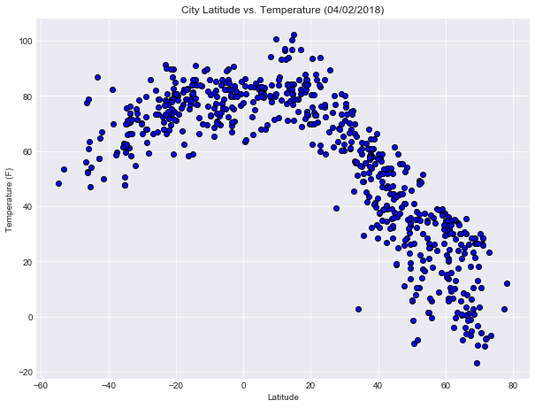
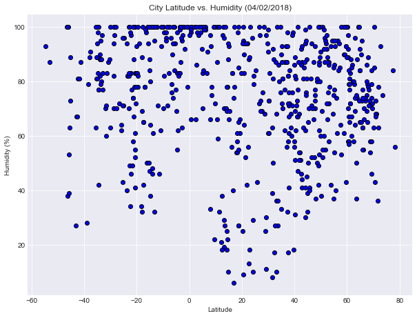
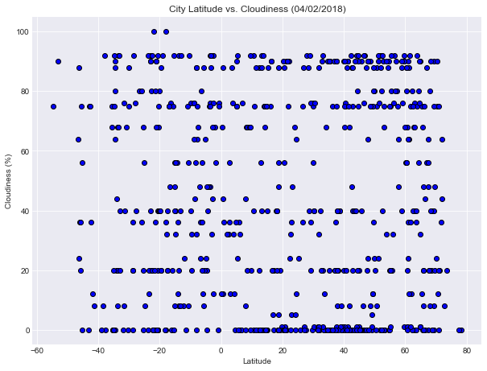
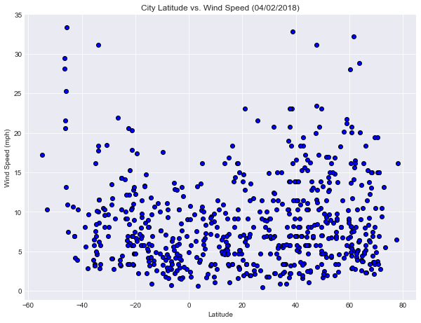

```python
import matplotlib.pyplot as plt
import requests
import pandas as pd
import numpy as np
from config import api_key
from citipy import citipy
```


```python
# generate random lat and lon
lat_list = np.random.uniform(-90,90,2000)
lon_list = np.random.uniform(-180,180,2000)
```


```python
# create a randomly selected city dataframe using citipy
city_list = []
country_list = []
for i in range(len(lat_list)):
    city = citipy.nearest_city(lat_list[i], lon_list[i])
    city_name = city.city_name
    country_code = city.country_code   
    if city_name not in city_list:
        city_list.append(city_name)
        country_list.append(country_code)
city_df = pd.DataFrame({"City": city_list,
                        "Country": country_list,
                        "Temperature (F)" : "",
                        "Humidity": "",
                        "Cloudiness": "",
                        "Wind Speed (mph)": "",
                        "Latitude": "",
                        "Longitude": ""
                        })
print(len(city_df["City"]))
```

    735


```python
# request from open weather map api and print the log info
url = f"http://api.openweathermap.org/data/2.5/weather?appid={api_key}&units=imperial&q="
for index, row in city_df.iterrows():
    response = requests.get(url+row["City"]+","+row["Country"])
    print(f"Request {index} {row['City']}, URL: {response.url}")    
    response_data = response.json()
    try:
        city_df.set_value(index, "Temperature (F)", response_data['main']['temp'])
        city_df.set_value(index, "Humidity", response_data['main']['humidity'])
        city_df.set_value(index, "Cloudiness", response_data['clouds']['all'])
        city_df.set_value(index, "Wind Speed (mph)", response_data['wind']['speed'])
        city_df.set_value(index, "Latitude", response_data['coord']['lat'])
        city_df.set_value(index, "Longitude", response_data['coord']['lon'])
    except (KeyError, IndexError):
        print("Missing field/result... skipping.")
```

    Request 0 vanimo, URL: http://api.openweathermap.org/data/2.5/weather?appid=6c7d0a89c4f1a465f8120ada4568232f&units=imperial&q=vanimo,pg


    /Users/jiemeizhang/anaconda3/envs/PythonData/lib/python3.6/site-packages/ipykernel_launcher.py:8: FutureWarning: set_value is deprecated and will be removed in a future release. Please use .at[] or .iat[] accessors instead
      
    /Users/jiemeizhang/anaconda3/envs/PythonData/lib/python3.6/site-packages/ipykernel_launcher.py:9: FutureWarning: set_value is deprecated and will be removed in a future release. Please use .at[] or .iat[] accessors instead
      if __name__ == '__main__':
    /Users/jiemeizhang/anaconda3/envs/PythonData/lib/python3.6/site-packages/ipykernel_launcher.py:10: FutureWarning: set_value is deprecated and will be removed in a future release. Please use .at[] or .iat[] accessors instead
      # Remove the CWD from sys.path while we load stuff.
    /Users/jiemeizhang/anaconda3/envs/PythonData/lib/python3.6/site-packages/ipykernel_launcher.py:11: FutureWarning: set_value is deprecated and will be removed in a future release. Please use .at[] or .iat[] accessors instead
      # This is added back by InteractiveShellApp.init_path()
    /Users/jiemeizhang/anaconda3/envs/PythonData/lib/python3.6/site-packages/ipykernel_launcher.py:12: FutureWarning: set_value is deprecated and will be removed in a future release. Please use .at[] or .iat[] accessors instead
      if sys.path[0] == '':
    /Users/jiemeizhang/anaconda3/envs/PythonData/lib/python3.6/site-packages/ipykernel_launcher.py:13: FutureWarning: set_value is deprecated and will be removed in a future release. Please use .at[] or .iat[] accessors instead
      del sys.path[0]


    Request 1 port alfred, URL: http://api.openweathermap.org/data/2.5/weather?appid=6c7d0a89c4f1a465f8120ada4568232f&units=imperial&q=port%20alfred,za
    Request 2 karakol, URL: http://api.openweathermap.org/data/2.5/weather?appid=6c7d0a89c4f1a465f8120ada4568232f&units=imperial&q=karakol,kg
    Request 3 beringovskiy, URL: http://api.openweathermap.org/data/2.5/weather?appid=6c7d0a89c4f1a465f8120ada4568232f&units=imperial&q=beringovskiy,ru
    Request 4 moroto, URL: http://api.openweathermap.org/data/2.5/weather?appid=6c7d0a89c4f1a465f8120ada4568232f&units=imperial&q=moroto,ug
    Request 5 camacha, URL: http://api.openweathermap.org/data/2.5/weather?appid=6c7d0a89c4f1a465f8120ada4568232f&units=imperial&q=camacha,pt
    Request 6 imeni poliny osipenko, URL: http://api.openweathermap.org/data/2.5/weather?appid=6c7d0a89c4f1a465f8120ada4568232f&units=imperial&q=imeni%20poliny%20osipenko,ru
    Request 7 taolanaro, URL: http://api.openweathermap.org/data/2.5/weather?appid=6c7d0a89c4f1a465f8120ada4568232f&units=imperial&q=taolanaro,mg
    Missing field/result... skipping.
    Request 8 cape town, URL: http://api.openweathermap.org/data/2.5/weather?appid=6c7d0a89c4f1a465f8120ada4568232f&units=imperial&q=cape%20town,za
    Request 9 kincardine, URL: http://api.openweathermap.org/data/2.5/weather?appid=6c7d0a89c4f1a465f8120ada4568232f&units=imperial&q=kincardine,ca
    Request 10 port elizabeth, URL: http://api.openweathermap.org/data/2.5/weather?appid=6c7d0a89c4f1a465f8120ada4568232f&units=imperial&q=port%20elizabeth,za
    Request 11 busselton, URL: http://api.openweathermap.org/data/2.5/weather?appid=6c7d0a89c4f1a465f8120ada4568232f&units=imperial&q=busselton,au
    Request 12 tangzhai, URL: http://api.openweathermap.org/data/2.5/weather?appid=6c7d0a89c4f1a465f8120ada4568232f&units=imperial&q=tangzhai,cn
    Request 13 hambantota, URL: http://api.openweathermap.org/data/2.5/weather?appid=6c7d0a89c4f1a465f8120ada4568232f&units=imperial&q=hambantota,lk
    Request 14 mehamn, URL: http://api.openweathermap.org/data/2.5/weather?appid=6c7d0a89c4f1a465f8120ada4568232f&units=imperial&q=mehamn,no
    Request 15 cabo san lucas, URL: http://api.openweathermap.org/data/2.5/weather?appid=6c7d0a89c4f1a465f8120ada4568232f&units=imperial&q=cabo%20san%20lucas,mx
    Request 16 nizhneyansk, URL: http://api.openweathermap.org/data/2.5/weather?appid=6c7d0a89c4f1a465f8120ada4568232f&units=imperial&q=nizhneyansk,ru
    Missing field/result... skipping.
    Request 17 mecca, URL: http://api.openweathermap.org/data/2.5/weather?appid=6c7d0a89c4f1a465f8120ada4568232f&units=imperial&q=mecca,sa
    Request 18 coahuayana, URL: http://api.openweathermap.org/data/2.5/weather?appid=6c7d0a89c4f1a465f8120ada4568232f&units=imperial&q=coahuayana,mx
    Request 19 paamiut, URL: http://api.openweathermap.org/data/2.5/weather?appid=6c7d0a89c4f1a465f8120ada4568232f&units=imperial&q=paamiut,gl
    Request 20 kahului, URL: http://api.openweathermap.org/data/2.5/weather?appid=6c7d0a89c4f1a465f8120ada4568232f&units=imperial&q=kahului,us
    Request 21 rolim de moura, URL: http://api.openweathermap.org/data/2.5/weather?appid=6c7d0a89c4f1a465f8120ada4568232f&units=imperial&q=rolim%20de%20moura,br
    Missing field/result... skipping.
    Request 22 albany, URL: http://api.openweathermap.org/data/2.5/weather?appid=6c7d0a89c4f1a465f8120ada4568232f&units=imperial&q=albany,au
    Request 23 ushuaia, URL: http://api.openweathermap.org/data/2.5/weather?appid=6c7d0a89c4f1a465f8120ada4568232f&units=imperial&q=ushuaia,ar
    Request 24 praia da vitoria, URL: http://api.openweathermap.org/data/2.5/weather?appid=6c7d0a89c4f1a465f8120ada4568232f&units=imperial&q=praia%20da%20vitoria,pt
    Request 25 mataura, URL: http://api.openweathermap.org/data/2.5/weather?appid=6c7d0a89c4f1a465f8120ada4568232f&units=imperial&q=mataura,pf
    Missing field/result... skipping.
    Request 26 butaritari, URL: http://api.openweathermap.org/data/2.5/weather?appid=6c7d0a89c4f1a465f8120ada4568232f&units=imperial&q=butaritari,ki
    Request 27 tuktoyaktuk, URL: http://api.openweathermap.org/data/2.5/weather?appid=6c7d0a89c4f1a465f8120ada4568232f&units=imperial&q=tuktoyaktuk,ca
    Request 28 bredasdorp, URL: http://api.openweathermap.org/data/2.5/weather?appid=6c7d0a89c4f1a465f8120ada4568232f&units=imperial&q=bredasdorp,za
    Request 29 iqaluit, URL: http://api.openweathermap.org/data/2.5/weather?appid=6c7d0a89c4f1a465f8120ada4568232f&units=imperial&q=iqaluit,ca
    Request 30 hermanus, URL: http://api.openweathermap.org/data/2.5/weather?appid=6c7d0a89c4f1a465f8120ada4568232f&units=imperial&q=hermanus,za
    Request 31 salamiyah, URL: http://api.openweathermap.org/data/2.5/weather?appid=6c7d0a89c4f1a465f8120ada4568232f&units=imperial&q=salamiyah,sy
    Request 32 jubb jannin, URL: http://api.openweathermap.org/data/2.5/weather?appid=6c7d0a89c4f1a465f8120ada4568232f&units=imperial&q=jubb%20jannin,lb
    Missing field/result... skipping.
    Request 33 saldanha, URL: http://api.openweathermap.org/data/2.5/weather?appid=6c7d0a89c4f1a465f8120ada4568232f&units=imperial&q=saldanha,za
    Request 34 rikitea, URL: http://api.openweathermap.org/data/2.5/weather?appid=6c7d0a89c4f1a465f8120ada4568232f&units=imperial&q=rikitea,pf
    Request 35 richards bay, URL: http://api.openweathermap.org/data/2.5/weather?appid=6c7d0a89c4f1a465f8120ada4568232f&units=imperial&q=richards%20bay,za
    Request 36 kyren, URL: http://api.openweathermap.org/data/2.5/weather?appid=6c7d0a89c4f1a465f8120ada4568232f&units=imperial&q=kyren,ru
    Request 37 qasigiannguit, URL: http://api.openweathermap.org/data/2.5/weather?appid=6c7d0a89c4f1a465f8120ada4568232f&units=imperial&q=qasigiannguit,gl
    Request 38 illoqqortoormiut, URL: http://api.openweathermap.org/data/2.5/weather?appid=6c7d0a89c4f1a465f8120ada4568232f&units=imperial&q=illoqqortoormiut,gl
    Missing field/result... skipping.
    Request 39 arraial do cabo, URL: http://api.openweathermap.org/data/2.5/weather?appid=6c7d0a89c4f1a465f8120ada4568232f&units=imperial&q=arraial%20do%20cabo,br
    Request 40 tarko-sale, URL: http://api.openweathermap.org/data/2.5/weather?appid=6c7d0a89c4f1a465f8120ada4568232f&units=imperial&q=tarko-sale,ru
    Request 41 east london, URL: http://api.openweathermap.org/data/2.5/weather?appid=6c7d0a89c4f1a465f8120ada4568232f&units=imperial&q=east%20london,za
    Request 42 koumac, URL: http://api.openweathermap.org/data/2.5/weather?appid=6c7d0a89c4f1a465f8120ada4568232f&units=imperial&q=koumac,nc
    Request 43 pisco, URL: http://api.openweathermap.org/data/2.5/weather?appid=6c7d0a89c4f1a465f8120ada4568232f&units=imperial&q=pisco,pe
    Request 44 igarka, URL: http://api.openweathermap.org/data/2.5/weather?appid=6c7d0a89c4f1a465f8120ada4568232f&units=imperial&q=igarka,ru
    Request 45 faanui, URL: http://api.openweathermap.org/data/2.5/weather?appid=6c7d0a89c4f1a465f8120ada4568232f&units=imperial&q=faanui,pf
    Request 46 chokurdakh, URL: http://api.openweathermap.org/data/2.5/weather?appid=6c7d0a89c4f1a465f8120ada4568232f&units=imperial&q=chokurdakh,ru
    Request 47 xuanwu, URL: http://api.openweathermap.org/data/2.5/weather?appid=6c7d0a89c4f1a465f8120ada4568232f&units=imperial&q=xuanwu,cn
    Request 48 guerrero negro, URL: http://api.openweathermap.org/data/2.5/weather?appid=6c7d0a89c4f1a465f8120ada4568232f&units=imperial&q=guerrero%20negro,mx
    Request 49 vaitupu, URL: http://api.openweathermap.org/data/2.5/weather?appid=6c7d0a89c4f1a465f8120ada4568232f&units=imperial&q=vaitupu,wf
    Missing field/result... skipping.
    Request 50 san patricio, URL: http://api.openweathermap.org/data/2.5/weather?appid=6c7d0a89c4f1a465f8120ada4568232f&units=imperial&q=san%20patricio,mx
    Request 51 punta arenas, URL: http://api.openweathermap.org/data/2.5/weather?appid=6c7d0a89c4f1a465f8120ada4568232f&units=imperial&q=punta%20arenas,cl
    Request 52 avarua, URL: http://api.openweathermap.org/data/2.5/weather?appid=6c7d0a89c4f1a465f8120ada4568232f&units=imperial&q=avarua,ck
    Request 53 clyde river, URL: http://api.openweathermap.org/data/2.5/weather?appid=6c7d0a89c4f1a465f8120ada4568232f&units=imperial&q=clyde%20river,ca
    Request 54 severo-kurilsk, URL: http://api.openweathermap.org/data/2.5/weather?appid=6c7d0a89c4f1a465f8120ada4568232f&units=imperial&q=severo-kurilsk,ru
    Request 55 bethel, URL: http://api.openweathermap.org/data/2.5/weather?appid=6c7d0a89c4f1a465f8120ada4568232f&units=imperial&q=bethel,us
    Request 56 stokmarknes, URL: http://api.openweathermap.org/data/2.5/weather?appid=6c7d0a89c4f1a465f8120ada4568232f&units=imperial&q=stokmarknes,no
    Request 57 hobart, URL: http://api.openweathermap.org/data/2.5/weather?appid=6c7d0a89c4f1a465f8120ada4568232f&units=imperial&q=hobart,au
    Request 58 noceto, URL: http://api.openweathermap.org/data/2.5/weather?appid=6c7d0a89c4f1a465f8120ada4568232f&units=imperial&q=noceto,it
    Request 59 lorengau, URL: http://api.openweathermap.org/data/2.5/weather?appid=6c7d0a89c4f1a465f8120ada4568232f&units=imperial&q=lorengau,pg
    Request 60 jalu, URL: http://api.openweathermap.org/data/2.5/weather?appid=6c7d0a89c4f1a465f8120ada4568232f&units=imperial&q=jalu,ly
    Request 61 tiarei, URL: http://api.openweathermap.org/data/2.5/weather?appid=6c7d0a89c4f1a465f8120ada4568232f&units=imperial&q=tiarei,pf
    Request 62 sheridan, URL: http://api.openweathermap.org/data/2.5/weather?appid=6c7d0a89c4f1a465f8120ada4568232f&units=imperial&q=sheridan,us
    Request 63 atuona, URL: http://api.openweathermap.org/data/2.5/weather?appid=6c7d0a89c4f1a465f8120ada4568232f&units=imperial&q=atuona,pf
    Request 64 longyearbyen, URL: http://api.openweathermap.org/data/2.5/weather?appid=6c7d0a89c4f1a465f8120ada4568232f&units=imperial&q=longyearbyen,sj
    Request 65 nabire, URL: http://api.openweathermap.org/data/2.5/weather?appid=6c7d0a89c4f1a465f8120ada4568232f&units=imperial&q=nabire,id
    Request 66 college, URL: http://api.openweathermap.org/data/2.5/weather?appid=6c7d0a89c4f1a465f8120ada4568232f&units=imperial&q=college,us
    Request 67 lolua, URL: http://api.openweathermap.org/data/2.5/weather?appid=6c7d0a89c4f1a465f8120ada4568232f&units=imperial&q=lolua,tv
    Missing field/result... skipping.
    Request 68 yar-sale, URL: http://api.openweathermap.org/data/2.5/weather?appid=6c7d0a89c4f1a465f8120ada4568232f&units=imperial&q=yar-sale,ru
    Request 69 victoria, URL: http://api.openweathermap.org/data/2.5/weather?appid=6c7d0a89c4f1a465f8120ada4568232f&units=imperial&q=victoria,sc
    Request 70 hilo, URL: http://api.openweathermap.org/data/2.5/weather?appid=6c7d0a89c4f1a465f8120ada4568232f&units=imperial&q=hilo,us
    Request 71 georgetown, URL: http://api.openweathermap.org/data/2.5/weather?appid=6c7d0a89c4f1a465f8120ada4568232f&units=imperial&q=georgetown,sh
    Request 72 springdale, URL: http://api.openweathermap.org/data/2.5/weather?appid=6c7d0a89c4f1a465f8120ada4568232f&units=imperial&q=springdale,ca
    Request 73 saint-philippe, URL: http://api.openweathermap.org/data/2.5/weather?appid=6c7d0a89c4f1a465f8120ada4568232f&units=imperial&q=saint-philippe,re
    Request 74 nanortalik, URL: http://api.openweathermap.org/data/2.5/weather?appid=6c7d0a89c4f1a465f8120ada4568232f&units=imperial&q=nanortalik,gl
    Request 75 ponta do sol, URL: http://api.openweathermap.org/data/2.5/weather?appid=6c7d0a89c4f1a465f8120ada4568232f&units=imperial&q=ponta%20do%20sol,cv
    Request 76 cranbrook, URL: http://api.openweathermap.org/data/2.5/weather?appid=6c7d0a89c4f1a465f8120ada4568232f&units=imperial&q=cranbrook,ca
    Request 77 tabiauea, URL: http://api.openweathermap.org/data/2.5/weather?appid=6c7d0a89c4f1a465f8120ada4568232f&units=imperial&q=tabiauea,ki
    Missing field/result... skipping.
    Request 78 te anau, URL: http://api.openweathermap.org/data/2.5/weather?appid=6c7d0a89c4f1a465f8120ada4568232f&units=imperial&q=te%20anau,nz
    Request 79 nikolskoye, URL: http://api.openweathermap.org/data/2.5/weather?appid=6c7d0a89c4f1a465f8120ada4568232f&units=imperial&q=nikolskoye,ru
    Request 80 khatanga, URL: http://api.openweathermap.org/data/2.5/weather?appid=6c7d0a89c4f1a465f8120ada4568232f&units=imperial&q=khatanga,ru
    Request 81 namatanai, URL: http://api.openweathermap.org/data/2.5/weather?appid=6c7d0a89c4f1a465f8120ada4568232f&units=imperial&q=namatanai,pg
    Request 82 kavieng, URL: http://api.openweathermap.org/data/2.5/weather?appid=6c7d0a89c4f1a465f8120ada4568232f&units=imperial&q=kavieng,pg
    Request 83 cockburn town, URL: http://api.openweathermap.org/data/2.5/weather?appid=6c7d0a89c4f1a465f8120ada4568232f&units=imperial&q=cockburn%20town,bs
    Request 84 leh, URL: http://api.openweathermap.org/data/2.5/weather?appid=6c7d0a89c4f1a465f8120ada4568232f&units=imperial&q=leh,in
    Request 85 sao filipe, URL: http://api.openweathermap.org/data/2.5/weather?appid=6c7d0a89c4f1a465f8120ada4568232f&units=imperial&q=sao%20filipe,cv
    Request 86 kapaa, URL: http://api.openweathermap.org/data/2.5/weather?appid=6c7d0a89c4f1a465f8120ada4568232f&units=imperial&q=kapaa,us
    Request 87 marzuq, URL: http://api.openweathermap.org/data/2.5/weather?appid=6c7d0a89c4f1a465f8120ada4568232f&units=imperial&q=marzuq,ly
    Missing field/result... skipping.
    Request 88 san juan, URL: http://api.openweathermap.org/data/2.5/weather?appid=6c7d0a89c4f1a465f8120ada4568232f&units=imperial&q=san%20juan,ph
    Request 89 new norfolk, URL: http://api.openweathermap.org/data/2.5/weather?appid=6c7d0a89c4f1a465f8120ada4568232f&units=imperial&q=new%20norfolk,au
    Request 90 esperance, URL: http://api.openweathermap.org/data/2.5/weather?appid=6c7d0a89c4f1a465f8120ada4568232f&units=imperial&q=esperance,au
    Request 91 kruisfontein, URL: http://api.openweathermap.org/data/2.5/weather?appid=6c7d0a89c4f1a465f8120ada4568232f&units=imperial&q=kruisfontein,za
    Request 92 salalah, URL: http://api.openweathermap.org/data/2.5/weather?appid=6c7d0a89c4f1a465f8120ada4568232f&units=imperial&q=salalah,om
    Request 93 caetite, URL: http://api.openweathermap.org/data/2.5/weather?appid=6c7d0a89c4f1a465f8120ada4568232f&units=imperial&q=caetite,br
    Request 94 barra do bugres, URL: http://api.openweathermap.org/data/2.5/weather?appid=6c7d0a89c4f1a465f8120ada4568232f&units=imperial&q=barra%20do%20bugres,br
    Request 95 tilichiki, URL: http://api.openweathermap.org/data/2.5/weather?appid=6c7d0a89c4f1a465f8120ada4568232f&units=imperial&q=tilichiki,ru
    Request 96 touros, URL: http://api.openweathermap.org/data/2.5/weather?appid=6c7d0a89c4f1a465f8120ada4568232f&units=imperial&q=touros,br
    Request 97 aksu, URL: http://api.openweathermap.org/data/2.5/weather?appid=6c7d0a89c4f1a465f8120ada4568232f&units=imperial&q=aksu,cn
    Request 98 mochishche, URL: http://api.openweathermap.org/data/2.5/weather?appid=6c7d0a89c4f1a465f8120ada4568232f&units=imperial&q=mochishche,ru
    Request 99 belushya guba, URL: http://api.openweathermap.org/data/2.5/weather?appid=6c7d0a89c4f1a465f8120ada4568232f&units=imperial&q=belushya%20guba,ru
    Missing field/result... skipping.
    Request 100 yerbogachen, URL: http://api.openweathermap.org/data/2.5/weather?appid=6c7d0a89c4f1a465f8120ada4568232f&units=imperial&q=yerbogachen,ru
    Request 101 shenjiamen, URL: http://api.openweathermap.org/data/2.5/weather?appid=6c7d0a89c4f1a465f8120ada4568232f&units=imperial&q=shenjiamen,cn
    Request 102 codrington, URL: http://api.openweathermap.org/data/2.5/weather?appid=6c7d0a89c4f1a465f8120ada4568232f&units=imperial&q=codrington,ag
    Missing field/result... skipping.
    Request 103 tokur, URL: http://api.openweathermap.org/data/2.5/weather?appid=6c7d0a89c4f1a465f8120ada4568232f&units=imperial&q=tokur,ru
    Request 104 tawang, URL: http://api.openweathermap.org/data/2.5/weather?appid=6c7d0a89c4f1a465f8120ada4568232f&units=imperial&q=tawang,in
    Request 105 ayan, URL: http://api.openweathermap.org/data/2.5/weather?appid=6c7d0a89c4f1a465f8120ada4568232f&units=imperial&q=ayan,ru
    Missing field/result... skipping.
    Request 106 gat, URL: http://api.openweathermap.org/data/2.5/weather?appid=6c7d0a89c4f1a465f8120ada4568232f&units=imperial&q=gat,ly
    Missing field/result... skipping.
    Request 107 hami, URL: http://api.openweathermap.org/data/2.5/weather?appid=6c7d0a89c4f1a465f8120ada4568232f&units=imperial&q=hami,cn
    Request 108 amazar, URL: http://api.openweathermap.org/data/2.5/weather?appid=6c7d0a89c4f1a465f8120ada4568232f&units=imperial&q=amazar,ru
    Request 109 nome, URL: http://api.openweathermap.org/data/2.5/weather?appid=6c7d0a89c4f1a465f8120ada4568232f&units=imperial&q=nome,us
    Request 110 idil, URL: http://api.openweathermap.org/data/2.5/weather?appid=6c7d0a89c4f1a465f8120ada4568232f&units=imperial&q=idil,tr
    Request 111 port hardy, URL: http://api.openweathermap.org/data/2.5/weather?appid=6c7d0a89c4f1a465f8120ada4568232f&units=imperial&q=port%20hardy,ca
    Request 112 mar del plata, URL: http://api.openweathermap.org/data/2.5/weather?appid=6c7d0a89c4f1a465f8120ada4568232f&units=imperial&q=mar%20del%20plata,ar
    Request 113 saskylakh, URL: http://api.openweathermap.org/data/2.5/weather?appid=6c7d0a89c4f1a465f8120ada4568232f&units=imperial&q=saskylakh,ru
    Request 114 vizinga, URL: http://api.openweathermap.org/data/2.5/weather?appid=6c7d0a89c4f1a465f8120ada4568232f&units=imperial&q=vizinga,ru
    Request 115 utiroa, URL: http://api.openweathermap.org/data/2.5/weather?appid=6c7d0a89c4f1a465f8120ada4568232f&units=imperial&q=utiroa,ki
    Missing field/result... skipping.
    Request 116 matara, URL: http://api.openweathermap.org/data/2.5/weather?appid=6c7d0a89c4f1a465f8120ada4568232f&units=imperial&q=matara,lk
    Request 117 ribeira grande, URL: http://api.openweathermap.org/data/2.5/weather?appid=6c7d0a89c4f1a465f8120ada4568232f&units=imperial&q=ribeira%20grande,pt
    Request 118 ternate, URL: http://api.openweathermap.org/data/2.5/weather?appid=6c7d0a89c4f1a465f8120ada4568232f&units=imperial&q=ternate,id
    Request 119 hithadhoo, URL: http://api.openweathermap.org/data/2.5/weather?appid=6c7d0a89c4f1a465f8120ada4568232f&units=imperial&q=hithadhoo,mv
    Request 120 olinda, URL: http://api.openweathermap.org/data/2.5/weather?appid=6c7d0a89c4f1a465f8120ada4568232f&units=imperial&q=olinda,br
    Request 121 mayya, URL: http://api.openweathermap.org/data/2.5/weather?appid=6c7d0a89c4f1a465f8120ada4568232f&units=imperial&q=mayya,ru
    Request 122 lima, URL: http://api.openweathermap.org/data/2.5/weather?appid=6c7d0a89c4f1a465f8120ada4568232f&units=imperial&q=lima,pe
    Request 123 benjamin constant, URL: http://api.openweathermap.org/data/2.5/weather?appid=6c7d0a89c4f1a465f8120ada4568232f&units=imperial&q=benjamin%20constant,br
    Request 124 billings, URL: http://api.openweathermap.org/data/2.5/weather?appid=6c7d0a89c4f1a465f8120ada4568232f&units=imperial&q=billings,us
    Request 125 iralaya, URL: http://api.openweathermap.org/data/2.5/weather?appid=6c7d0a89c4f1a465f8120ada4568232f&units=imperial&q=iralaya,hn
    Request 126 fortuna, URL: http://api.openweathermap.org/data/2.5/weather?appid=6c7d0a89c4f1a465f8120ada4568232f&units=imperial&q=fortuna,us
    Request 127 bathsheba, URL: http://api.openweathermap.org/data/2.5/weather?appid=6c7d0a89c4f1a465f8120ada4568232f&units=imperial&q=bathsheba,bb
    Request 128 ligayan, URL: http://api.openweathermap.org/data/2.5/weather?appid=6c7d0a89c4f1a465f8120ada4568232f&units=imperial&q=ligayan,ph
    Request 129 amderma, URL: http://api.openweathermap.org/data/2.5/weather?appid=6c7d0a89c4f1a465f8120ada4568232f&units=imperial&q=amderma,ru
    Missing field/result... skipping.
    Request 130 torbay, URL: http://api.openweathermap.org/data/2.5/weather?appid=6c7d0a89c4f1a465f8120ada4568232f&units=imperial&q=torbay,ca
    Request 131 geraldton, URL: http://api.openweathermap.org/data/2.5/weather?appid=6c7d0a89c4f1a465f8120ada4568232f&units=imperial&q=geraldton,au
    Request 132 vaini, URL: http://api.openweathermap.org/data/2.5/weather?appid=6c7d0a89c4f1a465f8120ada4568232f&units=imperial&q=vaini,to
    Request 133 saint anthony, URL: http://api.openweathermap.org/data/2.5/weather?appid=6c7d0a89c4f1a465f8120ada4568232f&units=imperial&q=saint%20anthony,ca
    Missing field/result... skipping.
    Request 134 vardo, URL: http://api.openweathermap.org/data/2.5/weather?appid=6c7d0a89c4f1a465f8120ada4568232f&units=imperial&q=vardo,no
    Request 135 azangaro, URL: http://api.openweathermap.org/data/2.5/weather?appid=6c7d0a89c4f1a465f8120ada4568232f&units=imperial&q=azangaro,pe
    Request 136 pechenga, URL: http://api.openweathermap.org/data/2.5/weather?appid=6c7d0a89c4f1a465f8120ada4568232f&units=imperial&q=pechenga,ru
    Request 137 altay, URL: http://api.openweathermap.org/data/2.5/weather?appid=6c7d0a89c4f1a465f8120ada4568232f&units=imperial&q=altay,cn
    Request 138 kodiak, URL: http://api.openweathermap.org/data/2.5/weather?appid=6c7d0a89c4f1a465f8120ada4568232f&units=imperial&q=kodiak,us
    Request 139 puerto ayora, URL: http://api.openweathermap.org/data/2.5/weather?appid=6c7d0a89c4f1a465f8120ada4568232f&units=imperial&q=puerto%20ayora,ec
    Request 140 de-kastri, URL: http://api.openweathermap.org/data/2.5/weather?appid=6c7d0a89c4f1a465f8120ada4568232f&units=imperial&q=de-kastri,ru
    Request 141 suluq, URL: http://api.openweathermap.org/data/2.5/weather?appid=6c7d0a89c4f1a465f8120ada4568232f&units=imperial&q=suluq,ly
    Request 142 makaha, URL: http://api.openweathermap.org/data/2.5/weather?appid=6c7d0a89c4f1a465f8120ada4568232f&units=imperial&q=makaha,us
    Request 143 nelson, URL: http://api.openweathermap.org/data/2.5/weather?appid=6c7d0a89c4f1a465f8120ada4568232f&units=imperial&q=nelson,ca
    Request 144 haines junction, URL: http://api.openweathermap.org/data/2.5/weather?appid=6c7d0a89c4f1a465f8120ada4568232f&units=imperial&q=haines%20junction,ca
    Request 145 cedar lake, URL: http://api.openweathermap.org/data/2.5/weather?appid=6c7d0a89c4f1a465f8120ada4568232f&units=imperial&q=cedar%20lake,us
    Request 146 hurghada, URL: http://api.openweathermap.org/data/2.5/weather?appid=6c7d0a89c4f1a465f8120ada4568232f&units=imperial&q=hurghada,eg
    Missing field/result... skipping.
    Request 147 samarai, URL: http://api.openweathermap.org/data/2.5/weather?appid=6c7d0a89c4f1a465f8120ada4568232f&units=imperial&q=samarai,pg
    Request 148 galesong, URL: http://api.openweathermap.org/data/2.5/weather?appid=6c7d0a89c4f1a465f8120ada4568232f&units=imperial&q=galesong,id
    Request 149 attawapiskat, URL: http://api.openweathermap.org/data/2.5/weather?appid=6c7d0a89c4f1a465f8120ada4568232f&units=imperial&q=attawapiskat,ca
    Missing field/result... skipping.
    Request 150 akdepe, URL: http://api.openweathermap.org/data/2.5/weather?appid=6c7d0a89c4f1a465f8120ada4568232f&units=imperial&q=akdepe,tm
    Request 151 kulu, URL: http://api.openweathermap.org/data/2.5/weather?appid=6c7d0a89c4f1a465f8120ada4568232f&units=imperial&q=kulu,tr
    Request 152 sadovoye, URL: http://api.openweathermap.org/data/2.5/weather?appid=6c7d0a89c4f1a465f8120ada4568232f&units=imperial&q=sadovoye,ru
    Request 153 nam tha, URL: http://api.openweathermap.org/data/2.5/weather?appid=6c7d0a89c4f1a465f8120ada4568232f&units=imperial&q=nam%20tha,la
    Missing field/result... skipping.
    Request 154 usinsk, URL: http://api.openweathermap.org/data/2.5/weather?appid=6c7d0a89c4f1a465f8120ada4568232f&units=imperial&q=usinsk,ru
    Request 155 flin flon, URL: http://api.openweathermap.org/data/2.5/weather?appid=6c7d0a89c4f1a465f8120ada4568232f&units=imperial&q=flin%20flon,ca
    Request 156 malwan, URL: http://api.openweathermap.org/data/2.5/weather?appid=6c7d0a89c4f1a465f8120ada4568232f&units=imperial&q=malwan,in
    Missing field/result... skipping.
    Request 157 karratha, URL: http://api.openweathermap.org/data/2.5/weather?appid=6c7d0a89c4f1a465f8120ada4568232f&units=imperial&q=karratha,au
    Request 158 luderitz, URL: http://api.openweathermap.org/data/2.5/weather?appid=6c7d0a89c4f1a465f8120ada4568232f&units=imperial&q=luderitz,na
    Request 159 barentsburg, URL: http://api.openweathermap.org/data/2.5/weather?appid=6c7d0a89c4f1a465f8120ada4568232f&units=imperial&q=barentsburg,sj
    Missing field/result... skipping.
    Request 160 yumen, URL: http://api.openweathermap.org/data/2.5/weather?appid=6c7d0a89c4f1a465f8120ada4568232f&units=imperial&q=yumen,cn
    Request 161 boguchar, URL: http://api.openweathermap.org/data/2.5/weather?appid=6c7d0a89c4f1a465f8120ada4568232f&units=imperial&q=boguchar,ru
    Request 162 baia de aries, URL: http://api.openweathermap.org/data/2.5/weather?appid=6c7d0a89c4f1a465f8120ada4568232f&units=imperial&q=baia%20de%20aries,ro
    Request 163 rantoul, URL: http://api.openweathermap.org/data/2.5/weather?appid=6c7d0a89c4f1a465f8120ada4568232f&units=imperial&q=rantoul,us
    Request 164 tonantins, URL: http://api.openweathermap.org/data/2.5/weather?appid=6c7d0a89c4f1a465f8120ada4568232f&units=imperial&q=tonantins,br
    Request 165 gizo, URL: http://api.openweathermap.org/data/2.5/weather?appid=6c7d0a89c4f1a465f8120ada4568232f&units=imperial&q=gizo,sb
    Request 166 eucaliptus, URL: http://api.openweathermap.org/data/2.5/weather?appid=6c7d0a89c4f1a465f8120ada4568232f&units=imperial&q=eucaliptus,bo
    Request 167 saint-francois, URL: http://api.openweathermap.org/data/2.5/weather?appid=6c7d0a89c4f1a465f8120ada4568232f&units=imperial&q=saint-francois,gp
    Request 168 barrow, URL: http://api.openweathermap.org/data/2.5/weather?appid=6c7d0a89c4f1a465f8120ada4568232f&units=imperial&q=barrow,us
    Request 169 teya, URL: http://api.openweathermap.org/data/2.5/weather?appid=6c7d0a89c4f1a465f8120ada4568232f&units=imperial&q=teya,ru
    Request 170 airai, URL: http://api.openweathermap.org/data/2.5/weather?appid=6c7d0a89c4f1a465f8120ada4568232f&units=imperial&q=airai,pw
    Missing field/result... skipping.
    Request 171 kongoussi, URL: http://api.openweathermap.org/data/2.5/weather?appid=6c7d0a89c4f1a465f8120ada4568232f&units=imperial&q=kongoussi,bf
    Request 172 simao, URL: http://api.openweathermap.org/data/2.5/weather?appid=6c7d0a89c4f1a465f8120ada4568232f&units=imperial&q=simao,cn
    Request 173 kieta, URL: http://api.openweathermap.org/data/2.5/weather?appid=6c7d0a89c4f1a465f8120ada4568232f&units=imperial&q=kieta,pg
    Request 174 lebu, URL: http://api.openweathermap.org/data/2.5/weather?appid=6c7d0a89c4f1a465f8120ada4568232f&units=imperial&q=lebu,cl
    Request 175 satitoa, URL: http://api.openweathermap.org/data/2.5/weather?appid=6c7d0a89c4f1a465f8120ada4568232f&units=imperial&q=satitoa,ws
    Missing field/result... skipping.
    Request 176 beloha, URL: http://api.openweathermap.org/data/2.5/weather?appid=6c7d0a89c4f1a465f8120ada4568232f&units=imperial&q=beloha,mg
    Request 177 shaunavon, URL: http://api.openweathermap.org/data/2.5/weather?appid=6c7d0a89c4f1a465f8120ada4568232f&units=imperial&q=shaunavon,ca
    Request 178 china, URL: http://api.openweathermap.org/data/2.5/weather?appid=6c7d0a89c4f1a465f8120ada4568232f&units=imperial&q=china,mx
    Request 179 dikson, URL: http://api.openweathermap.org/data/2.5/weather?appid=6c7d0a89c4f1a465f8120ada4568232f&units=imperial&q=dikson,ru
    Request 180 castro, URL: http://api.openweathermap.org/data/2.5/weather?appid=6c7d0a89c4f1a465f8120ada4568232f&units=imperial&q=castro,cl
    Request 181 mabay, URL: http://api.openweathermap.org/data/2.5/weather?appid=6c7d0a89c4f1a465f8120ada4568232f&units=imperial&q=mabay,ph
    Request 182 bud, URL: http://api.openweathermap.org/data/2.5/weather?appid=6c7d0a89c4f1a465f8120ada4568232f&units=imperial&q=bud,no
    Request 183 hokota, URL: http://api.openweathermap.org/data/2.5/weather?appid=6c7d0a89c4f1a465f8120ada4568232f&units=imperial&q=hokota,jp
    Request 184 thompson, URL: http://api.openweathermap.org/data/2.5/weather?appid=6c7d0a89c4f1a465f8120ada4568232f&units=imperial&q=thompson,ca
    Request 185 yuci, URL: http://api.openweathermap.org/data/2.5/weather?appid=6c7d0a89c4f1a465f8120ada4568232f&units=imperial&q=yuci,cn
    Request 186 baringo, URL: http://api.openweathermap.org/data/2.5/weather?appid=6c7d0a89c4f1a465f8120ada4568232f&units=imperial&q=baringo,ke
    Request 187 qaanaaq, URL: http://api.openweathermap.org/data/2.5/weather?appid=6c7d0a89c4f1a465f8120ada4568232f&units=imperial&q=qaanaaq,gl
    Request 188 zhezkazgan, URL: http://api.openweathermap.org/data/2.5/weather?appid=6c7d0a89c4f1a465f8120ada4568232f&units=imperial&q=zhezkazgan,kz
    Request 189 chaa-khol, URL: http://api.openweathermap.org/data/2.5/weather?appid=6c7d0a89c4f1a465f8120ada4568232f&units=imperial&q=chaa-khol,ru
    Missing field/result... skipping.
    Request 190 tieling, URL: http://api.openweathermap.org/data/2.5/weather?appid=6c7d0a89c4f1a465f8120ada4568232f&units=imperial&q=tieling,cn
    Request 191 waingapu, URL: http://api.openweathermap.org/data/2.5/weather?appid=6c7d0a89c4f1a465f8120ada4568232f&units=imperial&q=waingapu,id
    Request 192 chitungwiza, URL: http://api.openweathermap.org/data/2.5/weather?appid=6c7d0a89c4f1a465f8120ada4568232f&units=imperial&q=chitungwiza,zw
    Request 193 mys shmidta, URL: http://api.openweathermap.org/data/2.5/weather?appid=6c7d0a89c4f1a465f8120ada4568232f&units=imperial&q=mys%20shmidta,ru
    Missing field/result... skipping.
    Request 194 nurota, URL: http://api.openweathermap.org/data/2.5/weather?appid=6c7d0a89c4f1a465f8120ada4568232f&units=imperial&q=nurota,uz
    Request 195 byron bay, URL: http://api.openweathermap.org/data/2.5/weather?appid=6c7d0a89c4f1a465f8120ada4568232f&units=imperial&q=byron%20bay,au
    Request 196 guarapari, URL: http://api.openweathermap.org/data/2.5/weather?appid=6c7d0a89c4f1a465f8120ada4568232f&units=imperial&q=guarapari,br
    Request 197 sao felix do xingu, URL: http://api.openweathermap.org/data/2.5/weather?appid=6c7d0a89c4f1a465f8120ada4568232f&units=imperial&q=sao%20felix%20do%20xingu,br
    Request 198 pevek, URL: http://api.openweathermap.org/data/2.5/weather?appid=6c7d0a89c4f1a465f8120ada4568232f&units=imperial&q=pevek,ru
    Request 199 dongsheng, URL: http://api.openweathermap.org/data/2.5/weather?appid=6c7d0a89c4f1a465f8120ada4568232f&units=imperial&q=dongsheng,cn
    Request 200 caucaia, URL: http://api.openweathermap.org/data/2.5/weather?appid=6c7d0a89c4f1a465f8120ada4568232f&units=imperial&q=caucaia,br
    Request 201 mao, URL: http://api.openweathermap.org/data/2.5/weather?appid=6c7d0a89c4f1a465f8120ada4568232f&units=imperial&q=mao,td
    Request 202 norman wells, URL: http://api.openweathermap.org/data/2.5/weather?appid=6c7d0a89c4f1a465f8120ada4568232f&units=imperial&q=norman%20wells,ca
    Request 203 romitan, URL: http://api.openweathermap.org/data/2.5/weather?appid=6c7d0a89c4f1a465f8120ada4568232f&units=imperial&q=romitan,uz
    Request 204 litovko, URL: http://api.openweathermap.org/data/2.5/weather?appid=6c7d0a89c4f1a465f8120ada4568232f&units=imperial&q=litovko,ru
    Request 205 broken hill, URL: http://api.openweathermap.org/data/2.5/weather?appid=6c7d0a89c4f1a465f8120ada4568232f&units=imperial&q=broken%20hill,au
    Request 206 coquimbo, URL: http://api.openweathermap.org/data/2.5/weather?appid=6c7d0a89c4f1a465f8120ada4568232f&units=imperial&q=coquimbo,cl
    Request 207 cidreira, URL: http://api.openweathermap.org/data/2.5/weather?appid=6c7d0a89c4f1a465f8120ada4568232f&units=imperial&q=cidreira,br
    Request 208 bambous virieux, URL: http://api.openweathermap.org/data/2.5/weather?appid=6c7d0a89c4f1a465f8120ada4568232f&units=imperial&q=bambous%20virieux,mu
    Request 209 pangnirtung, URL: http://api.openweathermap.org/data/2.5/weather?appid=6c7d0a89c4f1a465f8120ada4568232f&units=imperial&q=pangnirtung,ca
    Request 210 wucheng, URL: http://api.openweathermap.org/data/2.5/weather?appid=6c7d0a89c4f1a465f8120ada4568232f&units=imperial&q=wucheng,cn
    Request 211 agadez, URL: http://api.openweathermap.org/data/2.5/weather?appid=6c7d0a89c4f1a465f8120ada4568232f&units=imperial&q=agadez,ne
    Request 212 teguldet, URL: http://api.openweathermap.org/data/2.5/weather?appid=6c7d0a89c4f1a465f8120ada4568232f&units=imperial&q=teguldet,ru
    Request 213 cherskiy, URL: http://api.openweathermap.org/data/2.5/weather?appid=6c7d0a89c4f1a465f8120ada4568232f&units=imperial&q=cherskiy,ru
    Request 214 berlevag, URL: http://api.openweathermap.org/data/2.5/weather?appid=6c7d0a89c4f1a465f8120ada4568232f&units=imperial&q=berlevag,no
    Request 215 yellowknife, URL: http://api.openweathermap.org/data/2.5/weather?appid=6c7d0a89c4f1a465f8120ada4568232f&units=imperial&q=yellowknife,ca
    Request 216 upernavik, URL: http://api.openweathermap.org/data/2.5/weather?appid=6c7d0a89c4f1a465f8120ada4568232f&units=imperial&q=upernavik,gl
    Request 217 riviere-au-renard, URL: http://api.openweathermap.org/data/2.5/weather?appid=6c7d0a89c4f1a465f8120ada4568232f&units=imperial&q=riviere-au-renard,ca
    Request 218 leningradskiy, URL: http://api.openweathermap.org/data/2.5/weather?appid=6c7d0a89c4f1a465f8120ada4568232f&units=imperial&q=leningradskiy,ru
    Request 219 porto walter, URL: http://api.openweathermap.org/data/2.5/weather?appid=6c7d0a89c4f1a465f8120ada4568232f&units=imperial&q=porto%20walter,br
    Request 220 anadyr, URL: http://api.openweathermap.org/data/2.5/weather?appid=6c7d0a89c4f1a465f8120ada4568232f&units=imperial&q=anadyr,ru
    Request 221 dyakonovo, URL: http://api.openweathermap.org/data/2.5/weather?appid=6c7d0a89c4f1a465f8120ada4568232f&units=imperial&q=dyakonovo,ru
    Missing field/result... skipping.
    Request 222 sesvete, URL: http://api.openweathermap.org/data/2.5/weather?appid=6c7d0a89c4f1a465f8120ada4568232f&units=imperial&q=sesvete,hr
    Request 223 vao, URL: http://api.openweathermap.org/data/2.5/weather?appid=6c7d0a89c4f1a465f8120ada4568232f&units=imperial&q=vao,nc
    Request 224 jamestown, URL: http://api.openweathermap.org/data/2.5/weather?appid=6c7d0a89c4f1a465f8120ada4568232f&units=imperial&q=jamestown,sh
    Request 225 faya, URL: http://api.openweathermap.org/data/2.5/weather?appid=6c7d0a89c4f1a465f8120ada4568232f&units=imperial&q=faya,td
    Missing field/result... skipping.
    Request 226 hecun, URL: http://api.openweathermap.org/data/2.5/weather?appid=6c7d0a89c4f1a465f8120ada4568232f&units=imperial&q=hecun,cn
    Request 227 skegness, URL: http://api.openweathermap.org/data/2.5/weather?appid=6c7d0a89c4f1a465f8120ada4568232f&units=imperial&q=skegness,gb
    Request 228 constitucion, URL: http://api.openweathermap.org/data/2.5/weather?appid=6c7d0a89c4f1a465f8120ada4568232f&units=imperial&q=constitucion,cl
    Request 229 deputatskiy, URL: http://api.openweathermap.org/data/2.5/weather?appid=6c7d0a89c4f1a465f8120ada4568232f&units=imperial&q=deputatskiy,ru
    Request 230 provideniya, URL: http://api.openweathermap.org/data/2.5/weather?appid=6c7d0a89c4f1a465f8120ada4568232f&units=imperial&q=provideniya,ru
    Request 231 alyangula, URL: http://api.openweathermap.org/data/2.5/weather?appid=6c7d0a89c4f1a465f8120ada4568232f&units=imperial&q=alyangula,au
    Request 232 mareeba, URL: http://api.openweathermap.org/data/2.5/weather?appid=6c7d0a89c4f1a465f8120ada4568232f&units=imperial&q=mareeba,au
    Request 233 naze, URL: http://api.openweathermap.org/data/2.5/weather?appid=6c7d0a89c4f1a465f8120ada4568232f&units=imperial&q=naze,jp
    Request 234 carnarvon, URL: http://api.openweathermap.org/data/2.5/weather?appid=6c7d0a89c4f1a465f8120ada4568232f&units=imperial&q=carnarvon,au
    Request 235 itarema, URL: http://api.openweathermap.org/data/2.5/weather?appid=6c7d0a89c4f1a465f8120ada4568232f&units=imperial&q=itarema,br
    Request 236 emerald, URL: http://api.openweathermap.org/data/2.5/weather?appid=6c7d0a89c4f1a465f8120ada4568232f&units=imperial&q=emerald,au
    Request 237 aykhal, URL: http://api.openweathermap.org/data/2.5/weather?appid=6c7d0a89c4f1a465f8120ada4568232f&units=imperial&q=aykhal,ru
    Request 238 bekhtery, URL: http://api.openweathermap.org/data/2.5/weather?appid=6c7d0a89c4f1a465f8120ada4568232f&units=imperial&q=bekhtery,ua
    Request 239 san lucas, URL: http://api.openweathermap.org/data/2.5/weather?appid=6c7d0a89c4f1a465f8120ada4568232f&units=imperial&q=san%20lucas,mx
    Request 240 buarcos, URL: http://api.openweathermap.org/data/2.5/weather?appid=6c7d0a89c4f1a465f8120ada4568232f&units=imperial&q=buarcos,pt
    Request 241 bluff, URL: http://api.openweathermap.org/data/2.5/weather?appid=6c7d0a89c4f1a465f8120ada4568232f&units=imperial&q=bluff,nz
    Request 242 nanticoke, URL: http://api.openweathermap.org/data/2.5/weather?appid=6c7d0a89c4f1a465f8120ada4568232f&units=imperial&q=nanticoke,ca
    Request 243 sento se, URL: http://api.openweathermap.org/data/2.5/weather?appid=6c7d0a89c4f1a465f8120ada4568232f&units=imperial&q=sento%20se,br
    Missing field/result... skipping.
    Request 244 popondetta, URL: http://api.openweathermap.org/data/2.5/weather?appid=6c7d0a89c4f1a465f8120ada4568232f&units=imperial&q=popondetta,pg
    Request 245 zaozerne, URL: http://api.openweathermap.org/data/2.5/weather?appid=6c7d0a89c4f1a465f8120ada4568232f&units=imperial&q=zaozerne,ua
    Request 246 kamenskoye, URL: http://api.openweathermap.org/data/2.5/weather?appid=6c7d0a89c4f1a465f8120ada4568232f&units=imperial&q=kamenskoye,ru
    Missing field/result... skipping.
    Request 247 srednekolymsk, URL: http://api.openweathermap.org/data/2.5/weather?appid=6c7d0a89c4f1a465f8120ada4568232f&units=imperial&q=srednekolymsk,ru
    Request 248 souillac, URL: http://api.openweathermap.org/data/2.5/weather?appid=6c7d0a89c4f1a465f8120ada4568232f&units=imperial&q=souillac,mu
    Request 249 tiksi, URL: http://api.openweathermap.org/data/2.5/weather?appid=6c7d0a89c4f1a465f8120ada4568232f&units=imperial&q=tiksi,ru
    Request 250 klaksvik, URL: http://api.openweathermap.org/data/2.5/weather?appid=6c7d0a89c4f1a465f8120ada4568232f&units=imperial&q=klaksvik,fo
    Request 251 xam nua, URL: http://api.openweathermap.org/data/2.5/weather?appid=6c7d0a89c4f1a465f8120ada4568232f&units=imperial&q=xam%20nua,la
    Request 252 lavrentiya, URL: http://api.openweathermap.org/data/2.5/weather?appid=6c7d0a89c4f1a465f8120ada4568232f&units=imperial&q=lavrentiya,ru
    Request 253 charters towers, URL: http://api.openweathermap.org/data/2.5/weather?appid=6c7d0a89c4f1a465f8120ada4568232f&units=imperial&q=charters%20towers,au
    Request 254 petropavlovsk-kamchatskiy, URL: http://api.openweathermap.org/data/2.5/weather?appid=6c7d0a89c4f1a465f8120ada4568232f&units=imperial&q=petropavlovsk-kamchatskiy,ru
    Request 255 sola, URL: http://api.openweathermap.org/data/2.5/weather?appid=6c7d0a89c4f1a465f8120ada4568232f&units=imperial&q=sola,vu
    Request 256 lagoa, URL: http://api.openweathermap.org/data/2.5/weather?appid=6c7d0a89c4f1a465f8120ada4568232f&units=imperial&q=lagoa,pt
    Request 257 pontes e lacerda, URL: http://api.openweathermap.org/data/2.5/weather?appid=6c7d0a89c4f1a465f8120ada4568232f&units=imperial&q=pontes%20e%20lacerda,br
    Request 258 bengkulu, URL: http://api.openweathermap.org/data/2.5/weather?appid=6c7d0a89c4f1a465f8120ada4568232f&units=imperial&q=bengkulu,id
    Missing field/result... skipping.
    Request 259 biak, URL: http://api.openweathermap.org/data/2.5/weather?appid=6c7d0a89c4f1a465f8120ada4568232f&units=imperial&q=biak,id
    Request 260 grand river south east, URL: http://api.openweathermap.org/data/2.5/weather?appid=6c7d0a89c4f1a465f8120ada4568232f&units=imperial&q=grand%20river%20south%20east,mu
    Missing field/result... skipping.
    Request 261 tasiilaq, URL: http://api.openweathermap.org/data/2.5/weather?appid=6c7d0a89c4f1a465f8120ada4568232f&units=imperial&q=tasiilaq,gl
    Request 262 kavaratti, URL: http://api.openweathermap.org/data/2.5/weather?appid=6c7d0a89c4f1a465f8120ada4568232f&units=imperial&q=kavaratti,in
    Request 263 arauca, URL: http://api.openweathermap.org/data/2.5/weather?appid=6c7d0a89c4f1a465f8120ada4568232f&units=imperial&q=arauca,co
    Request 264 drayton valley, URL: http://api.openweathermap.org/data/2.5/weather?appid=6c7d0a89c4f1a465f8120ada4568232f&units=imperial&q=drayton%20valley,ca
    Request 265 hay river, URL: http://api.openweathermap.org/data/2.5/weather?appid=6c7d0a89c4f1a465f8120ada4568232f&units=imperial&q=hay%20river,ca
    Request 266 olafsvik, URL: http://api.openweathermap.org/data/2.5/weather?appid=6c7d0a89c4f1a465f8120ada4568232f&units=imperial&q=olafsvik,is
    Missing field/result... skipping.
    Request 267 ust-maya, URL: http://api.openweathermap.org/data/2.5/weather?appid=6c7d0a89c4f1a465f8120ada4568232f&units=imperial&q=ust-maya,ru
    Request 268 lompoc, URL: http://api.openweathermap.org/data/2.5/weather?appid=6c7d0a89c4f1a465f8120ada4568232f&units=imperial&q=lompoc,us
    Request 269 broome, URL: http://api.openweathermap.org/data/2.5/weather?appid=6c7d0a89c4f1a465f8120ada4568232f&units=imperial&q=broome,au
    Request 270 talnakh, URL: http://api.openweathermap.org/data/2.5/weather?appid=6c7d0a89c4f1a465f8120ada4568232f&units=imperial&q=talnakh,ru
    Request 271 homer, URL: http://api.openweathermap.org/data/2.5/weather?appid=6c7d0a89c4f1a465f8120ada4568232f&units=imperial&q=homer,us
    Request 272 margate, URL: http://api.openweathermap.org/data/2.5/weather?appid=6c7d0a89c4f1a465f8120ada4568232f&units=imperial&q=margate,za
    Request 273 tandur, URL: http://api.openweathermap.org/data/2.5/weather?appid=6c7d0a89c4f1a465f8120ada4568232f&units=imperial&q=tandur,in
    Request 274 bac lieu, URL: http://api.openweathermap.org/data/2.5/weather?appid=6c7d0a89c4f1a465f8120ada4568232f&units=imperial&q=bac%20lieu,vn
    Missing field/result... skipping.
    Request 275 labuhan, URL: http://api.openweathermap.org/data/2.5/weather?appid=6c7d0a89c4f1a465f8120ada4568232f&units=imperial&q=labuhan,id
    Request 276 kemijarvi, URL: http://api.openweathermap.org/data/2.5/weather?appid=6c7d0a89c4f1a465f8120ada4568232f&units=imperial&q=kemijarvi,fi
    Missing field/result... skipping.
    Request 277 isangel, URL: http://api.openweathermap.org/data/2.5/weather?appid=6c7d0a89c4f1a465f8120ada4568232f&units=imperial&q=isangel,vu
    Request 278 vila velha, URL: http://api.openweathermap.org/data/2.5/weather?appid=6c7d0a89c4f1a465f8120ada4568232f&units=imperial&q=vila%20velha,br
    Request 279 florianopolis, URL: http://api.openweathermap.org/data/2.5/weather?appid=6c7d0a89c4f1a465f8120ada4568232f&units=imperial&q=florianopolis,br
    Request 280 palembang, URL: http://api.openweathermap.org/data/2.5/weather?appid=6c7d0a89c4f1a465f8120ada4568232f&units=imperial&q=palembang,id
    Request 281 linxia, URL: http://api.openweathermap.org/data/2.5/weather?appid=6c7d0a89c4f1a465f8120ada4568232f&units=imperial&q=linxia,cn
    Request 282 komsomolskiy, URL: http://api.openweathermap.org/data/2.5/weather?appid=6c7d0a89c4f1a465f8120ada4568232f&units=imperial&q=komsomolskiy,ru
    Request 283 sharan, URL: http://api.openweathermap.org/data/2.5/weather?appid=6c7d0a89c4f1a465f8120ada4568232f&units=imperial&q=sharan,af
    Request 284 rajshahi, URL: http://api.openweathermap.org/data/2.5/weather?appid=6c7d0a89c4f1a465f8120ada4568232f&units=imperial&q=rajshahi,bd
    Request 285 vanavara, URL: http://api.openweathermap.org/data/2.5/weather?appid=6c7d0a89c4f1a465f8120ada4568232f&units=imperial&q=vanavara,ru
    Request 286 corinto, URL: http://api.openweathermap.org/data/2.5/weather?appid=6c7d0a89c4f1a465f8120ada4568232f&units=imperial&q=corinto,ni
    Request 287 berbera, URL: http://api.openweathermap.org/data/2.5/weather?appid=6c7d0a89c4f1a465f8120ada4568232f&units=imperial&q=berbera,so
    Request 288 portoferraio, URL: http://api.openweathermap.org/data/2.5/weather?appid=6c7d0a89c4f1a465f8120ada4568232f&units=imperial&q=portoferraio,it
    Request 289 alta floresta, URL: http://api.openweathermap.org/data/2.5/weather?appid=6c7d0a89c4f1a465f8120ada4568232f&units=imperial&q=alta%20floresta,br
    Request 290 nago, URL: http://api.openweathermap.org/data/2.5/weather?appid=6c7d0a89c4f1a465f8120ada4568232f&units=imperial&q=nago,jp
    Request 291 kenai, URL: http://api.openweathermap.org/data/2.5/weather?appid=6c7d0a89c4f1a465f8120ada4568232f&units=imperial&q=kenai,us
    Request 292 terrace, URL: http://api.openweathermap.org/data/2.5/weather?appid=6c7d0a89c4f1a465f8120ada4568232f&units=imperial&q=terrace,ca
    Request 293 narasannapeta, URL: http://api.openweathermap.org/data/2.5/weather?appid=6c7d0a89c4f1a465f8120ada4568232f&units=imperial&q=narasannapeta,in
    Request 294 harper, URL: http://api.openweathermap.org/data/2.5/weather?appid=6c7d0a89c4f1a465f8120ada4568232f&units=imperial&q=harper,lr
    Request 295 russell, URL: http://api.openweathermap.org/data/2.5/weather?appid=6c7d0a89c4f1a465f8120ada4568232f&units=imperial&q=russell,nz
    Request 296 shonguy, URL: http://api.openweathermap.org/data/2.5/weather?appid=6c7d0a89c4f1a465f8120ada4568232f&units=imperial&q=shonguy,ru
    Request 297 ancud, URL: http://api.openweathermap.org/data/2.5/weather?appid=6c7d0a89c4f1a465f8120ada4568232f&units=imperial&q=ancud,cl
    Request 298 port macquarie, URL: http://api.openweathermap.org/data/2.5/weather?appid=6c7d0a89c4f1a465f8120ada4568232f&units=imperial&q=port%20macquarie,au
    Request 299 noumea, URL: http://api.openweathermap.org/data/2.5/weather?appid=6c7d0a89c4f1a465f8120ada4568232f&units=imperial&q=noumea,nc
    Request 300 pointe-noire, URL: http://api.openweathermap.org/data/2.5/weather?appid=6c7d0a89c4f1a465f8120ada4568232f&units=imperial&q=pointe-noire,gp
    Request 301 gobabis, URL: http://api.openweathermap.org/data/2.5/weather?appid=6c7d0a89c4f1a465f8120ada4568232f&units=imperial&q=gobabis,na
    Request 302 the valley, URL: http://api.openweathermap.org/data/2.5/weather?appid=6c7d0a89c4f1a465f8120ada4568232f&units=imperial&q=the%20valley,ai
    Request 303 ilulissat, URL: http://api.openweathermap.org/data/2.5/weather?appid=6c7d0a89c4f1a465f8120ada4568232f&units=imperial&q=ilulissat,gl
    Request 304 svetlogorsk, URL: http://api.openweathermap.org/data/2.5/weather?appid=6c7d0a89c4f1a465f8120ada4568232f&units=imperial&q=svetlogorsk,ru
    Request 305 los llanos de aridane, URL: http://api.openweathermap.org/data/2.5/weather?appid=6c7d0a89c4f1a465f8120ada4568232f&units=imperial&q=los%20llanos%20de%20aridane,es
    Request 306 tecoanapa, URL: http://api.openweathermap.org/data/2.5/weather?appid=6c7d0a89c4f1a465f8120ada4568232f&units=imperial&q=tecoanapa,mx
    Request 307 thinadhoo, URL: http://api.openweathermap.org/data/2.5/weather?appid=6c7d0a89c4f1a465f8120ada4568232f&units=imperial&q=thinadhoo,mv
    Request 308 saint albans, URL: http://api.openweathermap.org/data/2.5/weather?appid=6c7d0a89c4f1a465f8120ada4568232f&units=imperial&q=saint%20albans,us
    Request 309 valsamata, URL: http://api.openweathermap.org/data/2.5/weather?appid=6c7d0a89c4f1a465f8120ada4568232f&units=imperial&q=valsamata,gr
    Request 310 yulara, URL: http://api.openweathermap.org/data/2.5/weather?appid=6c7d0a89c4f1a465f8120ada4568232f&units=imperial&q=yulara,au
    Request 311 la paz, URL: http://api.openweathermap.org/data/2.5/weather?appid=6c7d0a89c4f1a465f8120ada4568232f&units=imperial&q=la%20paz,mx
    Request 312 hit, URL: http://api.openweathermap.org/data/2.5/weather?appid=6c7d0a89c4f1a465f8120ada4568232f&units=imperial&q=hit,iq
    Request 313 husavik, URL: http://api.openweathermap.org/data/2.5/weather?appid=6c7d0a89c4f1a465f8120ada4568232f&units=imperial&q=husavik,is
    Request 314 oriximina, URL: http://api.openweathermap.org/data/2.5/weather?appid=6c7d0a89c4f1a465f8120ada4568232f&units=imperial&q=oriximina,br
    Request 315 piojo, URL: http://api.openweathermap.org/data/2.5/weather?appid=6c7d0a89c4f1a465f8120ada4568232f&units=imperial&q=piojo,co
    Request 316 sarkand, URL: http://api.openweathermap.org/data/2.5/weather?appid=6c7d0a89c4f1a465f8120ada4568232f&units=imperial&q=sarkand,kz
    Request 317 victor harbor, URL: http://api.openweathermap.org/data/2.5/weather?appid=6c7d0a89c4f1a465f8120ada4568232f&units=imperial&q=victor%20harbor,au
    Request 318 zonguldak, URL: http://api.openweathermap.org/data/2.5/weather?appid=6c7d0a89c4f1a465f8120ada4568232f&units=imperial&q=zonguldak,tr
    Request 319 vila franca do campo, URL: http://api.openweathermap.org/data/2.5/weather?appid=6c7d0a89c4f1a465f8120ada4568232f&units=imperial&q=vila%20franca%20do%20campo,pt
    Request 320 ous, URL: http://api.openweathermap.org/data/2.5/weather?appid=6c7d0a89c4f1a465f8120ada4568232f&units=imperial&q=ous,ru
    Request 321 rawson, URL: http://api.openweathermap.org/data/2.5/weather?appid=6c7d0a89c4f1a465f8120ada4568232f&units=imperial&q=rawson,ar
    Request 322 progreso, URL: http://api.openweathermap.org/data/2.5/weather?appid=6c7d0a89c4f1a465f8120ada4568232f&units=imperial&q=progreso,mx
    Request 323 srandakan, URL: http://api.openweathermap.org/data/2.5/weather?appid=6c7d0a89c4f1a465f8120ada4568232f&units=imperial&q=srandakan,id
    Request 324 tuatapere, URL: http://api.openweathermap.org/data/2.5/weather?appid=6c7d0a89c4f1a465f8120ada4568232f&units=imperial&q=tuatapere,nz
    Request 325 ola, URL: http://api.openweathermap.org/data/2.5/weather?appid=6c7d0a89c4f1a465f8120ada4568232f&units=imperial&q=ola,ru
    Request 326 la ronge, URL: http://api.openweathermap.org/data/2.5/weather?appid=6c7d0a89c4f1a465f8120ada4568232f&units=imperial&q=la%20ronge,ca
    Request 327 chernyshevskiy, URL: http://api.openweathermap.org/data/2.5/weather?appid=6c7d0a89c4f1a465f8120ada4568232f&units=imperial&q=chernyshevskiy,ru
    Request 328 san andres, URL: http://api.openweathermap.org/data/2.5/weather?appid=6c7d0a89c4f1a465f8120ada4568232f&units=imperial&q=san%20andres,co
    Request 329 coihaique, URL: http://api.openweathermap.org/data/2.5/weather?appid=6c7d0a89c4f1a465f8120ada4568232f&units=imperial&q=coihaique,cl
    Request 330 rocha, URL: http://api.openweathermap.org/data/2.5/weather?appid=6c7d0a89c4f1a465f8120ada4568232f&units=imperial&q=rocha,uy
    Request 331 gualaquiza, URL: http://api.openweathermap.org/data/2.5/weather?appid=6c7d0a89c4f1a465f8120ada4568232f&units=imperial&q=gualaquiza,ec
    Request 332 grimari, URL: http://api.openweathermap.org/data/2.5/weather?appid=6c7d0a89c4f1a465f8120ada4568232f&units=imperial&q=grimari,cf
    Missing field/result... skipping.
    Request 333 saravan, URL: http://api.openweathermap.org/data/2.5/weather?appid=6c7d0a89c4f1a465f8120ada4568232f&units=imperial&q=saravan,la
    Missing field/result... skipping.
    Request 334 inyonga, URL: http://api.openweathermap.org/data/2.5/weather?appid=6c7d0a89c4f1a465f8120ada4568232f&units=imperial&q=inyonga,tz
    Request 335 laguna, URL: http://api.openweathermap.org/data/2.5/weather?appid=6c7d0a89c4f1a465f8120ada4568232f&units=imperial&q=laguna,br
    Missing field/result... skipping.
    Request 336 mogok, URL: http://api.openweathermap.org/data/2.5/weather?appid=6c7d0a89c4f1a465f8120ada4568232f&units=imperial&q=mogok,mm
    Request 337 ustka, URL: http://api.openweathermap.org/data/2.5/weather?appid=6c7d0a89c4f1a465f8120ada4568232f&units=imperial&q=ustka,pl
    Request 338 ngawen, URL: http://api.openweathermap.org/data/2.5/weather?appid=6c7d0a89c4f1a465f8120ada4568232f&units=imperial&q=ngawen,id
    Request 339 clarence town, URL: http://api.openweathermap.org/data/2.5/weather?appid=6c7d0a89c4f1a465f8120ada4568232f&units=imperial&q=clarence%20town,bs
    Request 340 necochea, URL: http://api.openweathermap.org/data/2.5/weather?appid=6c7d0a89c4f1a465f8120ada4568232f&units=imperial&q=necochea,ar
    Request 341 korla, URL: http://api.openweathermap.org/data/2.5/weather?appid=6c7d0a89c4f1a465f8120ada4568232f&units=imperial&q=korla,cn
    Request 342 sobolevo, URL: http://api.openweathermap.org/data/2.5/weather?appid=6c7d0a89c4f1a465f8120ada4568232f&units=imperial&q=sobolevo,ru
    Request 343 saint-augustin, URL: http://api.openweathermap.org/data/2.5/weather?appid=6c7d0a89c4f1a465f8120ada4568232f&units=imperial&q=saint-augustin,ca
    Request 344 bonavista, URL: http://api.openweathermap.org/data/2.5/weather?appid=6c7d0a89c4f1a465f8120ada4568232f&units=imperial&q=bonavista,ca
    Request 345 kholodnyy, URL: http://api.openweathermap.org/data/2.5/weather?appid=6c7d0a89c4f1a465f8120ada4568232f&units=imperial&q=kholodnyy,ru
    Request 346 linchuan, URL: http://api.openweathermap.org/data/2.5/weather?appid=6c7d0a89c4f1a465f8120ada4568232f&units=imperial&q=linchuan,cn
    Missing field/result... skipping.
    Request 347 mayo, URL: http://api.openweathermap.org/data/2.5/weather?appid=6c7d0a89c4f1a465f8120ada4568232f&units=imperial&q=mayo,ca
    Request 348 tananger, URL: http://api.openweathermap.org/data/2.5/weather?appid=6c7d0a89c4f1a465f8120ada4568232f&units=imperial&q=tananger,no
    Request 349 saleaula, URL: http://api.openweathermap.org/data/2.5/weather?appid=6c7d0a89c4f1a465f8120ada4568232f&units=imperial&q=saleaula,ws
    Missing field/result... skipping.
    Request 350 sal rei, URL: http://api.openweathermap.org/data/2.5/weather?appid=6c7d0a89c4f1a465f8120ada4568232f&units=imperial&q=sal%20rei,cv
    Request 351 koupela, URL: http://api.openweathermap.org/data/2.5/weather?appid=6c7d0a89c4f1a465f8120ada4568232f&units=imperial&q=koupela,bf
    Request 352 kachikau, URL: http://api.openweathermap.org/data/2.5/weather?appid=6c7d0a89c4f1a465f8120ada4568232f&units=imperial&q=kachikau,bw
    Missing field/result... skipping.
    Request 353 iskateley, URL: http://api.openweathermap.org/data/2.5/weather?appid=6c7d0a89c4f1a465f8120ada4568232f&units=imperial&q=iskateley,ru
    Request 354 saint-joseph, URL: http://api.openweathermap.org/data/2.5/weather?appid=6c7d0a89c4f1a465f8120ada4568232f&units=imperial&q=saint-joseph,re
    Request 355 haapiti, URL: http://api.openweathermap.org/data/2.5/weather?appid=6c7d0a89c4f1a465f8120ada4568232f&units=imperial&q=haapiti,pf
    Request 356 mogadishu, URL: http://api.openweathermap.org/data/2.5/weather?appid=6c7d0a89c4f1a465f8120ada4568232f&units=imperial&q=mogadishu,so
    Request 357 bandarbeyla, URL: http://api.openweathermap.org/data/2.5/weather?appid=6c7d0a89c4f1a465f8120ada4568232f&units=imperial&q=bandarbeyla,so
    Request 358 peterhead, URL: http://api.openweathermap.org/data/2.5/weather?appid=6c7d0a89c4f1a465f8120ada4568232f&units=imperial&q=peterhead,gb
    Request 359 la palma, URL: http://api.openweathermap.org/data/2.5/weather?appid=6c7d0a89c4f1a465f8120ada4568232f&units=imperial&q=la%20palma,pa
    Request 360 kandrian, URL: http://api.openweathermap.org/data/2.5/weather?appid=6c7d0a89c4f1a465f8120ada4568232f&units=imperial&q=kandrian,pg
    Request 361 mahibadhoo, URL: http://api.openweathermap.org/data/2.5/weather?appid=6c7d0a89c4f1a465f8120ada4568232f&units=imperial&q=mahibadhoo,mv
    Request 362 cedar city, URL: http://api.openweathermap.org/data/2.5/weather?appid=6c7d0a89c4f1a465f8120ada4568232f&units=imperial&q=cedar%20city,us
    Request 363 parit buntar, URL: http://api.openweathermap.org/data/2.5/weather?appid=6c7d0a89c4f1a465f8120ada4568232f&units=imperial&q=parit%20buntar,my
    Request 364 alofi, URL: http://api.openweathermap.org/data/2.5/weather?appid=6c7d0a89c4f1a465f8120ada4568232f&units=imperial&q=alofi,nu
    Request 365 ullapool, URL: http://api.openweathermap.org/data/2.5/weather?appid=6c7d0a89c4f1a465f8120ada4568232f&units=imperial&q=ullapool,gb
    Request 366 crotone, URL: http://api.openweathermap.org/data/2.5/weather?appid=6c7d0a89c4f1a465f8120ada4568232f&units=imperial&q=crotone,it
    Request 367 ulaangom, URL: http://api.openweathermap.org/data/2.5/weather?appid=6c7d0a89c4f1a465f8120ada4568232f&units=imperial&q=ulaangom,mn
    Request 368 roberval, URL: http://api.openweathermap.org/data/2.5/weather?appid=6c7d0a89c4f1a465f8120ada4568232f&units=imperial&q=roberval,ca
    Request 369 chuy, URL: http://api.openweathermap.org/data/2.5/weather?appid=6c7d0a89c4f1a465f8120ada4568232f&units=imperial&q=chuy,uy
    Request 370 wuwei, URL: http://api.openweathermap.org/data/2.5/weather?appid=6c7d0a89c4f1a465f8120ada4568232f&units=imperial&q=wuwei,cn
    Request 371 dunedin, URL: http://api.openweathermap.org/data/2.5/weather?appid=6c7d0a89c4f1a465f8120ada4568232f&units=imperial&q=dunedin,nz
    Request 372 toropets, URL: http://api.openweathermap.org/data/2.5/weather?appid=6c7d0a89c4f1a465f8120ada4568232f&units=imperial&q=toropets,ru
    Request 373 ahuimanu, URL: http://api.openweathermap.org/data/2.5/weather?appid=6c7d0a89c4f1a465f8120ada4568232f&units=imperial&q=ahuimanu,us
    Request 374 sakaiminato, URL: http://api.openweathermap.org/data/2.5/weather?appid=6c7d0a89c4f1a465f8120ada4568232f&units=imperial&q=sakaiminato,jp
    Request 375 juba, URL: http://api.openweathermap.org/data/2.5/weather?appid=6c7d0a89c4f1a465f8120ada4568232f&units=imperial&q=juba,sd
    Missing field/result... skipping.
    Request 376 pandan niog, URL: http://api.openweathermap.org/data/2.5/weather?appid=6c7d0a89c4f1a465f8120ada4568232f&units=imperial&q=pandan%20niog,ph
    Request 377 pativilca, URL: http://api.openweathermap.org/data/2.5/weather?appid=6c7d0a89c4f1a465f8120ada4568232f&units=imperial&q=pativilca,pe
    Request 378 seoul, URL: http://api.openweathermap.org/data/2.5/weather?appid=6c7d0a89c4f1a465f8120ada4568232f&units=imperial&q=seoul,kr
    Request 379 nakamura, URL: http://api.openweathermap.org/data/2.5/weather?appid=6c7d0a89c4f1a465f8120ada4568232f&units=imperial&q=nakamura,jp
    Request 380 mathathane, URL: http://api.openweathermap.org/data/2.5/weather?appid=6c7d0a89c4f1a465f8120ada4568232f&units=imperial&q=mathathane,bw
    Request 381 conakry, URL: http://api.openweathermap.org/data/2.5/weather?appid=6c7d0a89c4f1a465f8120ada4568232f&units=imperial&q=conakry,gn
    Request 382 sinnar, URL: http://api.openweathermap.org/data/2.5/weather?appid=6c7d0a89c4f1a465f8120ada4568232f&units=imperial&q=sinnar,sd
    Request 383 mentok, URL: http://api.openweathermap.org/data/2.5/weather?appid=6c7d0a89c4f1a465f8120ada4568232f&units=imperial&q=mentok,id
    Missing field/result... skipping.
    Request 384 dingle, URL: http://api.openweathermap.org/data/2.5/weather?appid=6c7d0a89c4f1a465f8120ada4568232f&units=imperial&q=dingle,ie
    Request 385 tambovka, URL: http://api.openweathermap.org/data/2.5/weather?appid=6c7d0a89c4f1a465f8120ada4568232f&units=imperial&q=tambovka,ru
    Request 386 akyab, URL: http://api.openweathermap.org/data/2.5/weather?appid=6c7d0a89c4f1a465f8120ada4568232f&units=imperial&q=akyab,mm
    Missing field/result... skipping.
    Request 387 buala, URL: http://api.openweathermap.org/data/2.5/weather?appid=6c7d0a89c4f1a465f8120ada4568232f&units=imperial&q=buala,sb
    Request 388 mount gambier, URL: http://api.openweathermap.org/data/2.5/weather?appid=6c7d0a89c4f1a465f8120ada4568232f&units=imperial&q=mount%20gambier,au
    Request 389 ust-nera, URL: http://api.openweathermap.org/data/2.5/weather?appid=6c7d0a89c4f1a465f8120ada4568232f&units=imperial&q=ust-nera,ru
    Request 390 sorland, URL: http://api.openweathermap.org/data/2.5/weather?appid=6c7d0a89c4f1a465f8120ada4568232f&units=imperial&q=sorland,no
    Request 391 chany, URL: http://api.openweathermap.org/data/2.5/weather?appid=6c7d0a89c4f1a465f8120ada4568232f&units=imperial&q=chany,ru
    Request 392 san rafael, URL: http://api.openweathermap.org/data/2.5/weather?appid=6c7d0a89c4f1a465f8120ada4568232f&units=imperial&q=san%20rafael,ar
    Request 393 bubaque, URL: http://api.openweathermap.org/data/2.5/weather?appid=6c7d0a89c4f1a465f8120ada4568232f&units=imperial&q=bubaque,gw
    Request 394 mahajanga, URL: http://api.openweathermap.org/data/2.5/weather?appid=6c7d0a89c4f1a465f8120ada4568232f&units=imperial&q=mahajanga,mg
    Request 395 manati, URL: http://api.openweathermap.org/data/2.5/weather?appid=6c7d0a89c4f1a465f8120ada4568232f&units=imperial&q=manati,cu
    Missing field/result... skipping.
    Request 396 mount isa, URL: http://api.openweathermap.org/data/2.5/weather?appid=6c7d0a89c4f1a465f8120ada4568232f&units=imperial&q=mount%20isa,au
    Request 397 hermosillo, URL: http://api.openweathermap.org/data/2.5/weather?appid=6c7d0a89c4f1a465f8120ada4568232f&units=imperial&q=hermosillo,mx
    Request 398 san quintin, URL: http://api.openweathermap.org/data/2.5/weather?appid=6c7d0a89c4f1a465f8120ada4568232f&units=imperial&q=san%20quintin,mx
    Missing field/result... skipping.
    Request 399 katsuura, URL: http://api.openweathermap.org/data/2.5/weather?appid=6c7d0a89c4f1a465f8120ada4568232f&units=imperial&q=katsuura,jp
    Request 400 hobyo, URL: http://api.openweathermap.org/data/2.5/weather?appid=6c7d0a89c4f1a465f8120ada4568232f&units=imperial&q=hobyo,so
    Request 401 egvekinot, URL: http://api.openweathermap.org/data/2.5/weather?appid=6c7d0a89c4f1a465f8120ada4568232f&units=imperial&q=egvekinot,ru
    Request 402 rawannawi, URL: http://api.openweathermap.org/data/2.5/weather?appid=6c7d0a89c4f1a465f8120ada4568232f&units=imperial&q=rawannawi,ki
    Missing field/result... skipping.
    Request 403 sonoita, URL: http://api.openweathermap.org/data/2.5/weather?appid=6c7d0a89c4f1a465f8120ada4568232f&units=imperial&q=sonoita,mx
    Missing field/result... skipping.
    Request 404 tsihombe, URL: http://api.openweathermap.org/data/2.5/weather?appid=6c7d0a89c4f1a465f8120ada4568232f&units=imperial&q=tsihombe,mg
    Missing field/result... skipping.
    Request 405 kumluca, URL: http://api.openweathermap.org/data/2.5/weather?appid=6c7d0a89c4f1a465f8120ada4568232f&units=imperial&q=kumluca,tr
    Request 406 taltal, URL: http://api.openweathermap.org/data/2.5/weather?appid=6c7d0a89c4f1a465f8120ada4568232f&units=imperial&q=taltal,cl
    Request 407 takoradi, URL: http://api.openweathermap.org/data/2.5/weather?appid=6c7d0a89c4f1a465f8120ada4568232f&units=imperial&q=takoradi,gh
    Request 408 iaciara, URL: http://api.openweathermap.org/data/2.5/weather?appid=6c7d0a89c4f1a465f8120ada4568232f&units=imperial&q=iaciara,br
    Request 409 liverpool, URL: http://api.openweathermap.org/data/2.5/weather?appid=6c7d0a89c4f1a465f8120ada4568232f&units=imperial&q=liverpool,ca
    Request 410 half moon bay, URL: http://api.openweathermap.org/data/2.5/weather?appid=6c7d0a89c4f1a465f8120ada4568232f&units=imperial&q=half%20moon%20bay,us
    Request 411 nantucket, URL: http://api.openweathermap.org/data/2.5/weather?appid=6c7d0a89c4f1a465f8120ada4568232f&units=imperial&q=nantucket,us
    Request 412 yarumal, URL: http://api.openweathermap.org/data/2.5/weather?appid=6c7d0a89c4f1a465f8120ada4568232f&units=imperial&q=yarumal,co
    Request 413 cartagena, URL: http://api.openweathermap.org/data/2.5/weather?appid=6c7d0a89c4f1a465f8120ada4568232f&units=imperial&q=cartagena,co
    Request 414 bani, URL: http://api.openweathermap.org/data/2.5/weather?appid=6c7d0a89c4f1a465f8120ada4568232f&units=imperial&q=bani,do
    Request 415 mahebourg, URL: http://api.openweathermap.org/data/2.5/weather?appid=6c7d0a89c4f1a465f8120ada4568232f&units=imperial&q=mahebourg,mu
    Request 416 kadykchan, URL: http://api.openweathermap.org/data/2.5/weather?appid=6c7d0a89c4f1a465f8120ada4568232f&units=imperial&q=kadykchan,ru
    Missing field/result... skipping.
    Request 417 hays, URL: http://api.openweathermap.org/data/2.5/weather?appid=6c7d0a89c4f1a465f8120ada4568232f&units=imperial&q=hays,us
    Request 418 pedernales, URL: http://api.openweathermap.org/data/2.5/weather?appid=6c7d0a89c4f1a465f8120ada4568232f&units=imperial&q=pedernales,do
    Request 419 namibe, URL: http://api.openweathermap.org/data/2.5/weather?appid=6c7d0a89c4f1a465f8120ada4568232f&units=imperial&q=namibe,ao
    Request 420 letlhakane, URL: http://api.openweathermap.org/data/2.5/weather?appid=6c7d0a89c4f1a465f8120ada4568232f&units=imperial&q=letlhakane,bw
    Request 421 onega, URL: http://api.openweathermap.org/data/2.5/weather?appid=6c7d0a89c4f1a465f8120ada4568232f&units=imperial&q=onega,ru
    Request 422 lensk, URL: http://api.openweathermap.org/data/2.5/weather?appid=6c7d0a89c4f1a465f8120ada4568232f&units=imperial&q=lensk,ru
    Request 423 verkhnevilyuysk, URL: http://api.openweathermap.org/data/2.5/weather?appid=6c7d0a89c4f1a465f8120ada4568232f&units=imperial&q=verkhnevilyuysk,ru
    Request 424 narsaq, URL: http://api.openweathermap.org/data/2.5/weather?appid=6c7d0a89c4f1a465f8120ada4568232f&units=imperial&q=narsaq,gl
    Request 425 hervey bay, URL: http://api.openweathermap.org/data/2.5/weather?appid=6c7d0a89c4f1a465f8120ada4568232f&units=imperial&q=hervey%20bay,au
    Request 426 elmadag, URL: http://api.openweathermap.org/data/2.5/weather?appid=6c7d0a89c4f1a465f8120ada4568232f&units=imperial&q=elmadag,tr
    Request 427 naftah, URL: http://api.openweathermap.org/data/2.5/weather?appid=6c7d0a89c4f1a465f8120ada4568232f&units=imperial&q=naftah,tn
    Missing field/result... skipping.
    Request 428 oneonta, URL: http://api.openweathermap.org/data/2.5/weather?appid=6c7d0a89c4f1a465f8120ada4568232f&units=imperial&q=oneonta,us
    Request 429 ust-kamchatsk, URL: http://api.openweathermap.org/data/2.5/weather?appid=6c7d0a89c4f1a465f8120ada4568232f&units=imperial&q=ust-kamchatsk,ru
    Missing field/result... skipping.
    Request 430 lowestoft, URL: http://api.openweathermap.org/data/2.5/weather?appid=6c7d0a89c4f1a465f8120ada4568232f&units=imperial&q=lowestoft,gb
    Request 431 esso, URL: http://api.openweathermap.org/data/2.5/weather?appid=6c7d0a89c4f1a465f8120ada4568232f&units=imperial&q=esso,ru
    Request 432 port lincoln, URL: http://api.openweathermap.org/data/2.5/weather?appid=6c7d0a89c4f1a465f8120ada4568232f&units=imperial&q=port%20lincoln,au
    Request 433 fomboni, URL: http://api.openweathermap.org/data/2.5/weather?appid=6c7d0a89c4f1a465f8120ada4568232f&units=imperial&q=fomboni,km
    Request 434 shieli, URL: http://api.openweathermap.org/data/2.5/weather?appid=6c7d0a89c4f1a465f8120ada4568232f&units=imperial&q=shieli,kz
    Request 435 ahipara, URL: http://api.openweathermap.org/data/2.5/weather?appid=6c7d0a89c4f1a465f8120ada4568232f&units=imperial&q=ahipara,nz
    Request 436 awjilah, URL: http://api.openweathermap.org/data/2.5/weather?appid=6c7d0a89c4f1a465f8120ada4568232f&units=imperial&q=awjilah,ly
    Request 437 nyagan, URL: http://api.openweathermap.org/data/2.5/weather?appid=6c7d0a89c4f1a465f8120ada4568232f&units=imperial&q=nyagan,ru
    Request 438 makakilo city, URL: http://api.openweathermap.org/data/2.5/weather?appid=6c7d0a89c4f1a465f8120ada4568232f&units=imperial&q=makakilo%20city,us
    Request 439 ushtobe, URL: http://api.openweathermap.org/data/2.5/weather?appid=6c7d0a89c4f1a465f8120ada4568232f&units=imperial&q=ushtobe,kz
    Request 440 pafos, URL: http://api.openweathermap.org/data/2.5/weather?appid=6c7d0a89c4f1a465f8120ada4568232f&units=imperial&q=pafos,cy
    Missing field/result... skipping.
    Request 441 ulma, URL: http://api.openweathermap.org/data/2.5/weather?appid=6c7d0a89c4f1a465f8120ada4568232f&units=imperial&q=ulma,ro
    Request 442 aswan, URL: http://api.openweathermap.org/data/2.5/weather?appid=6c7d0a89c4f1a465f8120ada4568232f&units=imperial&q=aswan,eg
    Request 443 moranbah, URL: http://api.openweathermap.org/data/2.5/weather?appid=6c7d0a89c4f1a465f8120ada4568232f&units=imperial&q=moranbah,au
    Request 444 kaka, URL: http://api.openweathermap.org/data/2.5/weather?appid=6c7d0a89c4f1a465f8120ada4568232f&units=imperial&q=kaka,tm
    Request 445 seymchan, URL: http://api.openweathermap.org/data/2.5/weather?appid=6c7d0a89c4f1a465f8120ada4568232f&units=imperial&q=seymchan,ru
    Request 446 umzimvubu, URL: http://api.openweathermap.org/data/2.5/weather?appid=6c7d0a89c4f1a465f8120ada4568232f&units=imperial&q=umzimvubu,za
    Missing field/result... skipping.
    Request 447 talara, URL: http://api.openweathermap.org/data/2.5/weather?appid=6c7d0a89c4f1a465f8120ada4568232f&units=imperial&q=talara,pe
    Request 448 cabral, URL: http://api.openweathermap.org/data/2.5/weather?appid=6c7d0a89c4f1a465f8120ada4568232f&units=imperial&q=cabral,do
    Request 449 shar, URL: http://api.openweathermap.org/data/2.5/weather?appid=6c7d0a89c4f1a465f8120ada4568232f&units=imperial&q=shar,kz
    Request 450 faro, URL: http://api.openweathermap.org/data/2.5/weather?appid=6c7d0a89c4f1a465f8120ada4568232f&units=imperial&q=faro,pt
    Request 451 alice springs, URL: http://api.openweathermap.org/data/2.5/weather?appid=6c7d0a89c4f1a465f8120ada4568232f&units=imperial&q=alice%20springs,au
    Request 452 gulu, URL: http://api.openweathermap.org/data/2.5/weather?appid=6c7d0a89c4f1a465f8120ada4568232f&units=imperial&q=gulu,ug
    Request 453 alibag, URL: http://api.openweathermap.org/data/2.5/weather?appid=6c7d0a89c4f1a465f8120ada4568232f&units=imperial&q=alibag,in
    Request 454 dasoguz, URL: http://api.openweathermap.org/data/2.5/weather?appid=6c7d0a89c4f1a465f8120ada4568232f&units=imperial&q=dasoguz,tm
    Request 455 camargo, URL: http://api.openweathermap.org/data/2.5/weather?appid=6c7d0a89c4f1a465f8120ada4568232f&units=imperial&q=camargo,bo
    Request 456 lasa, URL: http://api.openweathermap.org/data/2.5/weather?appid=6c7d0a89c4f1a465f8120ada4568232f&units=imperial&q=lasa,cn
    Missing field/result... skipping.
    Request 457 pyay, URL: http://api.openweathermap.org/data/2.5/weather?appid=6c7d0a89c4f1a465f8120ada4568232f&units=imperial&q=pyay,mm
    Request 458 santa isabel, URL: http://api.openweathermap.org/data/2.5/weather?appid=6c7d0a89c4f1a465f8120ada4568232f&units=imperial&q=santa%20isabel,mx
    Request 459 saurimo, URL: http://api.openweathermap.org/data/2.5/weather?appid=6c7d0a89c4f1a465f8120ada4568232f&units=imperial&q=saurimo,ao
    Request 460 jinxiang, URL: http://api.openweathermap.org/data/2.5/weather?appid=6c7d0a89c4f1a465f8120ada4568232f&units=imperial&q=jinxiang,cn
    Request 461 kraksaan, URL: http://api.openweathermap.org/data/2.5/weather?appid=6c7d0a89c4f1a465f8120ada4568232f&units=imperial&q=kraksaan,id
    Request 462 sorvag, URL: http://api.openweathermap.org/data/2.5/weather?appid=6c7d0a89c4f1a465f8120ada4568232f&units=imperial&q=sorvag,fo
    Missing field/result... skipping.
    Request 463 markova, URL: http://api.openweathermap.org/data/2.5/weather?appid=6c7d0a89c4f1a465f8120ada4568232f&units=imperial&q=markova,ru
    Request 464 temerloh, URL: http://api.openweathermap.org/data/2.5/weather?appid=6c7d0a89c4f1a465f8120ada4568232f&units=imperial&q=temerloh,my
    Request 465 bergen, URL: http://api.openweathermap.org/data/2.5/weather?appid=6c7d0a89c4f1a465f8120ada4568232f&units=imperial&q=bergen,nl
    Request 466 kosonsoy, URL: http://api.openweathermap.org/data/2.5/weather?appid=6c7d0a89c4f1a465f8120ada4568232f&units=imperial&q=kosonsoy,uz
    Request 467 bikin, URL: http://api.openweathermap.org/data/2.5/weather?appid=6c7d0a89c4f1a465f8120ada4568232f&units=imperial&q=bikin,ru
    Request 468 north bend, URL: http://api.openweathermap.org/data/2.5/weather?appid=6c7d0a89c4f1a465f8120ada4568232f&units=imperial&q=north%20bend,us
    Request 469 eureka, URL: http://api.openweathermap.org/data/2.5/weather?appid=6c7d0a89c4f1a465f8120ada4568232f&units=imperial&q=eureka,us
    Request 470 chiang khong, URL: http://api.openweathermap.org/data/2.5/weather?appid=6c7d0a89c4f1a465f8120ada4568232f&units=imperial&q=chiang%20khong,th
    Request 471 galiwinku, URL: http://api.openweathermap.org/data/2.5/weather?appid=6c7d0a89c4f1a465f8120ada4568232f&units=imperial&q=galiwinku,au
    Missing field/result... skipping.
    Request 472 arlington, URL: http://api.openweathermap.org/data/2.5/weather?appid=6c7d0a89c4f1a465f8120ada4568232f&units=imperial&q=arlington,us
    Request 473 marcona, URL: http://api.openweathermap.org/data/2.5/weather?appid=6c7d0a89c4f1a465f8120ada4568232f&units=imperial&q=marcona,pe
    Missing field/result... skipping.
    Request 474 kazalinsk, URL: http://api.openweathermap.org/data/2.5/weather?appid=6c7d0a89c4f1a465f8120ada4568232f&units=imperial&q=kazalinsk,kz
    Missing field/result... skipping.
    Request 475 nizhniy odes, URL: http://api.openweathermap.org/data/2.5/weather?appid=6c7d0a89c4f1a465f8120ada4568232f&units=imperial&q=nizhniy%20odes,ru
    Request 476 tahoua, URL: http://api.openweathermap.org/data/2.5/weather?appid=6c7d0a89c4f1a465f8120ada4568232f&units=imperial&q=tahoua,ne
    Request 477 quatre cocos, URL: http://api.openweathermap.org/data/2.5/weather?appid=6c7d0a89c4f1a465f8120ada4568232f&units=imperial&q=quatre%20cocos,mu
    Request 478 cayenne, URL: http://api.openweathermap.org/data/2.5/weather?appid=6c7d0a89c4f1a465f8120ada4568232f&units=imperial&q=cayenne,gf
    Request 479 kaitangata, URL: http://api.openweathermap.org/data/2.5/weather?appid=6c7d0a89c4f1a465f8120ada4568232f&units=imperial&q=kaitangata,nz
    Request 480 tunduru, URL: http://api.openweathermap.org/data/2.5/weather?appid=6c7d0a89c4f1a465f8120ada4568232f&units=imperial&q=tunduru,tz
    Missing field/result... skipping.
    Request 481 lata, URL: http://api.openweathermap.org/data/2.5/weather?appid=6c7d0a89c4f1a465f8120ada4568232f&units=imperial&q=lata,sb
    Missing field/result... skipping.
    Request 482 puerto cabezas, URL: http://api.openweathermap.org/data/2.5/weather?appid=6c7d0a89c4f1a465f8120ada4568232f&units=imperial&q=puerto%20cabezas,ni
    Request 483 champerico, URL: http://api.openweathermap.org/data/2.5/weather?appid=6c7d0a89c4f1a465f8120ada4568232f&units=imperial&q=champerico,gt
    Request 484 bacuit, URL: http://api.openweathermap.org/data/2.5/weather?appid=6c7d0a89c4f1a465f8120ada4568232f&units=imperial&q=bacuit,ph
    Missing field/result... skipping.
    Request 485 fort saint john, URL: http://api.openweathermap.org/data/2.5/weather?appid=6c7d0a89c4f1a465f8120ada4568232f&units=imperial&q=fort%20saint%20john,ca
    Missing field/result... skipping.
    Request 486 morondava, URL: http://api.openweathermap.org/data/2.5/weather?appid=6c7d0a89c4f1a465f8120ada4568232f&units=imperial&q=morondava,mg
    Request 487 abu samrah, URL: http://api.openweathermap.org/data/2.5/weather?appid=6c7d0a89c4f1a465f8120ada4568232f&units=imperial&q=abu%20samrah,qa
    Missing field/result... skipping.
    Request 488 rumford, URL: http://api.openweathermap.org/data/2.5/weather?appid=6c7d0a89c4f1a465f8120ada4568232f&units=imperial&q=rumford,us
    Request 489 kakching, URL: http://api.openweathermap.org/data/2.5/weather?appid=6c7d0a89c4f1a465f8120ada4568232f&units=imperial&q=kakching,in
    Request 490 itai, URL: http://api.openweathermap.org/data/2.5/weather?appid=6c7d0a89c4f1a465f8120ada4568232f&units=imperial&q=itai,br
    Request 491 tocopilla, URL: http://api.openweathermap.org/data/2.5/weather?appid=6c7d0a89c4f1a465f8120ada4568232f&units=imperial&q=tocopilla,cl
    Request 492 portland, URL: http://api.openweathermap.org/data/2.5/weather?appid=6c7d0a89c4f1a465f8120ada4568232f&units=imperial&q=portland,au
    Request 493 sitka, URL: http://api.openweathermap.org/data/2.5/weather?appid=6c7d0a89c4f1a465f8120ada4568232f&units=imperial&q=sitka,us
    Request 494 pakwach, URL: http://api.openweathermap.org/data/2.5/weather?appid=6c7d0a89c4f1a465f8120ada4568232f&units=imperial&q=pakwach,ug
    Missing field/result... skipping.
    Request 495 comodoro rivadavia, URL: http://api.openweathermap.org/data/2.5/weather?appid=6c7d0a89c4f1a465f8120ada4568232f&units=imperial&q=comodoro%20rivadavia,ar
    Request 496 hofn, URL: http://api.openweathermap.org/data/2.5/weather?appid=6c7d0a89c4f1a465f8120ada4568232f&units=imperial&q=hofn,is
    Request 497 magnor, URL: http://api.openweathermap.org/data/2.5/weather?appid=6c7d0a89c4f1a465f8120ada4568232f&units=imperial&q=magnor,no
    Missing field/result... skipping.
    Request 498 krasnoborsk, URL: http://api.openweathermap.org/data/2.5/weather?appid=6c7d0a89c4f1a465f8120ada4568232f&units=imperial&q=krasnoborsk,ru
    Request 499 sabla, URL: http://api.openweathermap.org/data/2.5/weather?appid=6c7d0a89c4f1a465f8120ada4568232f&units=imperial&q=sabla,bg
    Missing field/result... skipping.
    Request 500 pemba, URL: http://api.openweathermap.org/data/2.5/weather?appid=6c7d0a89c4f1a465f8120ada4568232f&units=imperial&q=pemba,mz
    Request 501 sentyabrskiy, URL: http://api.openweathermap.org/data/2.5/weather?appid=6c7d0a89c4f1a465f8120ada4568232f&units=imperial&q=sentyabrskiy,ru
    Missing field/result... skipping.
    Request 502 pirgos, URL: http://api.openweathermap.org/data/2.5/weather?appid=6c7d0a89c4f1a465f8120ada4568232f&units=imperial&q=pirgos,gr
    Request 503 letka, URL: http://api.openweathermap.org/data/2.5/weather?appid=6c7d0a89c4f1a465f8120ada4568232f&units=imperial&q=letka,ru
    Request 504 luan, URL: http://api.openweathermap.org/data/2.5/weather?appid=6c7d0a89c4f1a465f8120ada4568232f&units=imperial&q=luan,cn
    Missing field/result... skipping.
    Request 505 tukums, URL: http://api.openweathermap.org/data/2.5/weather?appid=6c7d0a89c4f1a465f8120ada4568232f&units=imperial&q=tukums,lv
    Request 506 clyde, URL: http://api.openweathermap.org/data/2.5/weather?appid=6c7d0a89c4f1a465f8120ada4568232f&units=imperial&q=clyde,nz
    Request 507 ati, URL: http://api.openweathermap.org/data/2.5/weather?appid=6c7d0a89c4f1a465f8120ada4568232f&units=imperial&q=ati,td
    Request 508 pascagoula, URL: http://api.openweathermap.org/data/2.5/weather?appid=6c7d0a89c4f1a465f8120ada4568232f&units=imperial&q=pascagoula,us
    Request 509 flinders, URL: http://api.openweathermap.org/data/2.5/weather?appid=6c7d0a89c4f1a465f8120ada4568232f&units=imperial&q=flinders,au
    Request 510 bilibino, URL: http://api.openweathermap.org/data/2.5/weather?appid=6c7d0a89c4f1a465f8120ada4568232f&units=imperial&q=bilibino,ru
    Request 511 sambava, URL: http://api.openweathermap.org/data/2.5/weather?appid=6c7d0a89c4f1a465f8120ada4568232f&units=imperial&q=sambava,mg
    Request 512 turukhansk, URL: http://api.openweathermap.org/data/2.5/weather?appid=6c7d0a89c4f1a465f8120ada4568232f&units=imperial&q=turukhansk,ru
    Request 513 caravelas, URL: http://api.openweathermap.org/data/2.5/weather?appid=6c7d0a89c4f1a465f8120ada4568232f&units=imperial&q=caravelas,br
    Request 514 kristiinankaupunki, URL: http://api.openweathermap.org/data/2.5/weather?appid=6c7d0a89c4f1a465f8120ada4568232f&units=imperial&q=kristiinankaupunki,fi
    Missing field/result... skipping.
    Request 515 warrington, URL: http://api.openweathermap.org/data/2.5/weather?appid=6c7d0a89c4f1a465f8120ada4568232f&units=imperial&q=warrington,us
    Request 516 bantogon, URL: http://api.openweathermap.org/data/2.5/weather?appid=6c7d0a89c4f1a465f8120ada4568232f&units=imperial&q=bantogon,ph
    Request 517 ksenyevka, URL: http://api.openweathermap.org/data/2.5/weather?appid=6c7d0a89c4f1a465f8120ada4568232f&units=imperial&q=ksenyevka,ru
    Missing field/result... skipping.
    Request 518 muros, URL: http://api.openweathermap.org/data/2.5/weather?appid=6c7d0a89c4f1a465f8120ada4568232f&units=imperial&q=muros,es
    Request 519 taoudenni, URL: http://api.openweathermap.org/data/2.5/weather?appid=6c7d0a89c4f1a465f8120ada4568232f&units=imperial&q=taoudenni,ml
    Request 520 oranjemund, URL: http://api.openweathermap.org/data/2.5/weather?appid=6c7d0a89c4f1a465f8120ada4568232f&units=imperial&q=oranjemund,na
    Request 521 uige, URL: http://api.openweathermap.org/data/2.5/weather?appid=6c7d0a89c4f1a465f8120ada4568232f&units=imperial&q=uige,ao
    Request 522 uvarovka, URL: http://api.openweathermap.org/data/2.5/weather?appid=6c7d0a89c4f1a465f8120ada4568232f&units=imperial&q=uvarovka,ru
    Request 523 tramore, URL: http://api.openweathermap.org/data/2.5/weather?appid=6c7d0a89c4f1a465f8120ada4568232f&units=imperial&q=tramore,ie
    Request 524 fairbanks, URL: http://api.openweathermap.org/data/2.5/weather?appid=6c7d0a89c4f1a465f8120ada4568232f&units=imperial&q=fairbanks,us
    Request 525 northam, URL: http://api.openweathermap.org/data/2.5/weather?appid=6c7d0a89c4f1a465f8120ada4568232f&units=imperial&q=northam,au
    Request 526 bardiyah, URL: http://api.openweathermap.org/data/2.5/weather?appid=6c7d0a89c4f1a465f8120ada4568232f&units=imperial&q=bardiyah,ly
    Request 527 koster, URL: http://api.openweathermap.org/data/2.5/weather?appid=6c7d0a89c4f1a465f8120ada4568232f&units=imperial&q=koster,za
    Request 528 ardakan, URL: http://api.openweathermap.org/data/2.5/weather?appid=6c7d0a89c4f1a465f8120ada4568232f&units=imperial&q=ardakan,ir
    Request 529 trinidad, URL: http://api.openweathermap.org/data/2.5/weather?appid=6c7d0a89c4f1a465f8120ada4568232f&units=imperial&q=trinidad,cu
    Request 530 saint-paul, URL: http://api.openweathermap.org/data/2.5/weather?appid=6c7d0a89c4f1a465f8120ada4568232f&units=imperial&q=saint-paul,re
    Request 531 wuhan, URL: http://api.openweathermap.org/data/2.5/weather?appid=6c7d0a89c4f1a465f8120ada4568232f&units=imperial&q=wuhan,cn
    Request 532 mamakan, URL: http://api.openweathermap.org/data/2.5/weather?appid=6c7d0a89c4f1a465f8120ada4568232f&units=imperial&q=mamakan,ru
    Request 533 samusu, URL: http://api.openweathermap.org/data/2.5/weather?appid=6c7d0a89c4f1a465f8120ada4568232f&units=imperial&q=samusu,ws
    Missing field/result... skipping.
    Request 534 isla aguada, URL: http://api.openweathermap.org/data/2.5/weather?appid=6c7d0a89c4f1a465f8120ada4568232f&units=imperial&q=isla%20aguada,mx
    Request 535 avera, URL: http://api.openweathermap.org/data/2.5/weather?appid=6c7d0a89c4f1a465f8120ada4568232f&units=imperial&q=avera,pf
    Missing field/result... skipping.
    Request 536 rena, URL: http://api.openweathermap.org/data/2.5/weather?appid=6c7d0a89c4f1a465f8120ada4568232f&units=imperial&q=rena,no
    Request 537 baykit, URL: http://api.openweathermap.org/data/2.5/weather?appid=6c7d0a89c4f1a465f8120ada4568232f&units=imperial&q=baykit,ru
    Request 538 barcelona, URL: http://api.openweathermap.org/data/2.5/weather?appid=6c7d0a89c4f1a465f8120ada4568232f&units=imperial&q=barcelona,ph
    Request 539 dondo, URL: http://api.openweathermap.org/data/2.5/weather?appid=6c7d0a89c4f1a465f8120ada4568232f&units=imperial&q=dondo,mz
    Request 540 zhanaozen, URL: http://api.openweathermap.org/data/2.5/weather?appid=6c7d0a89c4f1a465f8120ada4568232f&units=imperial&q=zhanaozen,kz
    Request 541 tumannyy, URL: http://api.openweathermap.org/data/2.5/weather?appid=6c7d0a89c4f1a465f8120ada4568232f&units=imperial&q=tumannyy,ru
    Missing field/result... skipping.
    Request 542 sierra vista, URL: http://api.openweathermap.org/data/2.5/weather?appid=6c7d0a89c4f1a465f8120ada4568232f&units=imperial&q=sierra%20vista,us
    Request 543 jackson, URL: http://api.openweathermap.org/data/2.5/weather?appid=6c7d0a89c4f1a465f8120ada4568232f&units=imperial&q=jackson,us
    Request 544 ouadda, URL: http://api.openweathermap.org/data/2.5/weather?appid=6c7d0a89c4f1a465f8120ada4568232f&units=imperial&q=ouadda,cf
    Request 545 nouadhibou, URL: http://api.openweathermap.org/data/2.5/weather?appid=6c7d0a89c4f1a465f8120ada4568232f&units=imperial&q=nouadhibou,mr
    Request 546 zorgo, URL: http://api.openweathermap.org/data/2.5/weather?appid=6c7d0a89c4f1a465f8120ada4568232f&units=imperial&q=zorgo,bf
    Missing field/result... skipping.
    Request 547 juli, URL: http://api.openweathermap.org/data/2.5/weather?appid=6c7d0a89c4f1a465f8120ada4568232f&units=imperial&q=juli,pe
    Request 548 getulio vargas, URL: http://api.openweathermap.org/data/2.5/weather?appid=6c7d0a89c4f1a465f8120ada4568232f&units=imperial&q=getulio%20vargas,br
    Missing field/result... skipping.
    Request 549 gladstone, URL: http://api.openweathermap.org/data/2.5/weather?appid=6c7d0a89c4f1a465f8120ada4568232f&units=imperial&q=gladstone,au
    Request 550 atar, URL: http://api.openweathermap.org/data/2.5/weather?appid=6c7d0a89c4f1a465f8120ada4568232f&units=imperial&q=atar,mr
    Request 551 santa ines, URL: http://api.openweathermap.org/data/2.5/weather?appid=6c7d0a89c4f1a465f8120ada4568232f&units=imperial&q=santa%20ines,br
    Missing field/result... skipping.
    Request 552 darhan, URL: http://api.openweathermap.org/data/2.5/weather?appid=6c7d0a89c4f1a465f8120ada4568232f&units=imperial&q=darhan,mn
    Request 553 poplar bluff, URL: http://api.openweathermap.org/data/2.5/weather?appid=6c7d0a89c4f1a465f8120ada4568232f&units=imperial&q=poplar%20bluff,us
    Request 554 lithakia, URL: http://api.openweathermap.org/data/2.5/weather?appid=6c7d0a89c4f1a465f8120ada4568232f&units=imperial&q=lithakia,gr
    Request 555 oktyabrskoye, URL: http://api.openweathermap.org/data/2.5/weather?appid=6c7d0a89c4f1a465f8120ada4568232f&units=imperial&q=oktyabrskoye,ru
    Request 556 finschhafen, URL: http://api.openweathermap.org/data/2.5/weather?appid=6c7d0a89c4f1a465f8120ada4568232f&units=imperial&q=finschhafen,pg
    Request 557 mocambique, URL: http://api.openweathermap.org/data/2.5/weather?appid=6c7d0a89c4f1a465f8120ada4568232f&units=imperial&q=mocambique,mz
    Missing field/result... skipping.
    Request 558 jacksonville beach, URL: http://api.openweathermap.org/data/2.5/weather?appid=6c7d0a89c4f1a465f8120ada4568232f&units=imperial&q=jacksonville%20beach,us
    Request 559 ambon, URL: http://api.openweathermap.org/data/2.5/weather?appid=6c7d0a89c4f1a465f8120ada4568232f&units=imperial&q=ambon,id
    Request 560 shelburne, URL: http://api.openweathermap.org/data/2.5/weather?appid=6c7d0a89c4f1a465f8120ada4568232f&units=imperial&q=shelburne,ca
    Request 561 ginda, URL: http://api.openweathermap.org/data/2.5/weather?appid=6c7d0a89c4f1a465f8120ada4568232f&units=imperial&q=ginda,er
    Missing field/result... skipping.
    Request 562 shihezi, URL: http://api.openweathermap.org/data/2.5/weather?appid=6c7d0a89c4f1a465f8120ada4568232f&units=imperial&q=shihezi,cn
    Request 563 esna, URL: http://api.openweathermap.org/data/2.5/weather?appid=6c7d0a89c4f1a465f8120ada4568232f&units=imperial&q=esna,eg
    Missing field/result... skipping.
    Request 564 itambe, URL: http://api.openweathermap.org/data/2.5/weather?appid=6c7d0a89c4f1a465f8120ada4568232f&units=imperial&q=itambe,br
    Request 565 ryotsu, URL: http://api.openweathermap.org/data/2.5/weather?appid=6c7d0a89c4f1a465f8120ada4568232f&units=imperial&q=ryotsu,jp
    Request 566 krasnorechenskiy, URL: http://api.openweathermap.org/data/2.5/weather?appid=6c7d0a89c4f1a465f8120ada4568232f&units=imperial&q=krasnorechenskiy,ru
    Request 567 roald, URL: http://api.openweathermap.org/data/2.5/weather?appid=6c7d0a89c4f1a465f8120ada4568232f&units=imperial&q=roald,no
    Request 568 indiaroba, URL: http://api.openweathermap.org/data/2.5/weather?appid=6c7d0a89c4f1a465f8120ada4568232f&units=imperial&q=indiaroba,br
    Request 569 venice, URL: http://api.openweathermap.org/data/2.5/weather?appid=6c7d0a89c4f1a465f8120ada4568232f&units=imperial&q=venice,us
    Request 570 yubari, URL: http://api.openweathermap.org/data/2.5/weather?appid=6c7d0a89c4f1a465f8120ada4568232f&units=imperial&q=yubari,jp
    Missing field/result... skipping.
    Request 571 saryozek, URL: http://api.openweathermap.org/data/2.5/weather?appid=6c7d0a89c4f1a465f8120ada4568232f&units=imperial&q=saryozek,kz
    Request 572 rundu, URL: http://api.openweathermap.org/data/2.5/weather?appid=6c7d0a89c4f1a465f8120ada4568232f&units=imperial&q=rundu,na
    Request 573 vostok, URL: http://api.openweathermap.org/data/2.5/weather?appid=6c7d0a89c4f1a465f8120ada4568232f&units=imperial&q=vostok,ru
    Request 574 ballina, URL: http://api.openweathermap.org/data/2.5/weather?appid=6c7d0a89c4f1a465f8120ada4568232f&units=imperial&q=ballina,au
    Request 575 aden, URL: http://api.openweathermap.org/data/2.5/weather?appid=6c7d0a89c4f1a465f8120ada4568232f&units=imperial&q=aden,ye
    Request 576 walvis bay, URL: http://api.openweathermap.org/data/2.5/weather?appid=6c7d0a89c4f1a465f8120ada4568232f&units=imperial&q=walvis%20bay,na
    Request 577 batemans bay, URL: http://api.openweathermap.org/data/2.5/weather?appid=6c7d0a89c4f1a465f8120ada4568232f&units=imperial&q=batemans%20bay,au
    Request 578 phimai, URL: http://api.openweathermap.org/data/2.5/weather?appid=6c7d0a89c4f1a465f8120ada4568232f&units=imperial&q=phimai,th
    Request 579 koutiala, URL: http://api.openweathermap.org/data/2.5/weather?appid=6c7d0a89c4f1a465f8120ada4568232f&units=imperial&q=koutiala,ml
    Request 580 kaeo, URL: http://api.openweathermap.org/data/2.5/weather?appid=6c7d0a89c4f1a465f8120ada4568232f&units=imperial&q=kaeo,nz
    Request 581 launceston, URL: http://api.openweathermap.org/data/2.5/weather?appid=6c7d0a89c4f1a465f8120ada4568232f&units=imperial&q=launceston,au
    Request 582 kayes, URL: http://api.openweathermap.org/data/2.5/weather?appid=6c7d0a89c4f1a465f8120ada4568232f&units=imperial&q=kayes,ml
    Request 583 poya, URL: http://api.openweathermap.org/data/2.5/weather?appid=6c7d0a89c4f1a465f8120ada4568232f&units=imperial&q=poya,nc
    Request 584 ust-kuyga, URL: http://api.openweathermap.org/data/2.5/weather?appid=6c7d0a89c4f1a465f8120ada4568232f&units=imperial&q=ust-kuyga,ru
    Request 585 fort nelson, URL: http://api.openweathermap.org/data/2.5/weather?appid=6c7d0a89c4f1a465f8120ada4568232f&units=imperial&q=fort%20nelson,ca
    Request 586 sao joao da barra, URL: http://api.openweathermap.org/data/2.5/weather?appid=6c7d0a89c4f1a465f8120ada4568232f&units=imperial&q=sao%20joao%20da%20barra,br
    Request 587 filadelfia, URL: http://api.openweathermap.org/data/2.5/weather?appid=6c7d0a89c4f1a465f8120ada4568232f&units=imperial&q=filadelfia,py
    Request 588 tuy hoa, URL: http://api.openweathermap.org/data/2.5/weather?appid=6c7d0a89c4f1a465f8120ada4568232f&units=imperial&q=tuy%20hoa,vn
    Request 589 bandiagara, URL: http://api.openweathermap.org/data/2.5/weather?appid=6c7d0a89c4f1a465f8120ada4568232f&units=imperial&q=bandiagara,ml
    Request 590 mazyr, URL: http://api.openweathermap.org/data/2.5/weather?appid=6c7d0a89c4f1a465f8120ada4568232f&units=imperial&q=mazyr,by
    Request 591 eyl, URL: http://api.openweathermap.org/data/2.5/weather?appid=6c7d0a89c4f1a465f8120ada4568232f&units=imperial&q=eyl,so
    Request 592 boyuibe, URL: http://api.openweathermap.org/data/2.5/weather?appid=6c7d0a89c4f1a465f8120ada4568232f&units=imperial&q=boyuibe,bo
    Request 593 tazovskiy, URL: http://api.openweathermap.org/data/2.5/weather?appid=6c7d0a89c4f1a465f8120ada4568232f&units=imperial&q=tazovskiy,ru
    Request 594 honningsvag, URL: http://api.openweathermap.org/data/2.5/weather?appid=6c7d0a89c4f1a465f8120ada4568232f&units=imperial&q=honningsvag,no
    Request 595 tual, URL: http://api.openweathermap.org/data/2.5/weather?appid=6c7d0a89c4f1a465f8120ada4568232f&units=imperial&q=tual,id
    Request 596 shakawe, URL: http://api.openweathermap.org/data/2.5/weather?appid=6c7d0a89c4f1a465f8120ada4568232f&units=imperial&q=shakawe,bw
    Request 597 baie-comeau, URL: http://api.openweathermap.org/data/2.5/weather?appid=6c7d0a89c4f1a465f8120ada4568232f&units=imperial&q=baie-comeau,ca
    Request 598 maniitsoq, URL: http://api.openweathermap.org/data/2.5/weather?appid=6c7d0a89c4f1a465f8120ada4568232f&units=imperial&q=maniitsoq,gl
    Request 599 sao joao do paraiso, URL: http://api.openweathermap.org/data/2.5/weather?appid=6c7d0a89c4f1a465f8120ada4568232f&units=imperial&q=sao%20joao%20do%20paraiso,br
    Request 600 gruiu, URL: http://api.openweathermap.org/data/2.5/weather?appid=6c7d0a89c4f1a465f8120ada4568232f&units=imperial&q=gruiu,ro
    Request 601 chagda, URL: http://api.openweathermap.org/data/2.5/weather?appid=6c7d0a89c4f1a465f8120ada4568232f&units=imperial&q=chagda,ru
    Missing field/result... skipping.
    Request 602 muroto, URL: http://api.openweathermap.org/data/2.5/weather?appid=6c7d0a89c4f1a465f8120ada4568232f&units=imperial&q=muroto,jp
    Request 603 zhanatas, URL: http://api.openweathermap.org/data/2.5/weather?appid=6c7d0a89c4f1a465f8120ada4568232f&units=imperial&q=zhanatas,kz
    Missing field/result... skipping.
    Request 604 marsh harbour, URL: http://api.openweathermap.org/data/2.5/weather?appid=6c7d0a89c4f1a465f8120ada4568232f&units=imperial&q=marsh%20harbour,bs
    Request 605 truth or consequences, URL: http://api.openweathermap.org/data/2.5/weather?appid=6c7d0a89c4f1a465f8120ada4568232f&units=imperial&q=truth%20or%20consequences,us
    Request 606 kivsharivka, URL: http://api.openweathermap.org/data/2.5/weather?appid=6c7d0a89c4f1a465f8120ada4568232f&units=imperial&q=kivsharivka,ua
    Request 607 san borja, URL: http://api.openweathermap.org/data/2.5/weather?appid=6c7d0a89c4f1a465f8120ada4568232f&units=imperial&q=san%20borja,bo
    Request 608 batman, URL: http://api.openweathermap.org/data/2.5/weather?appid=6c7d0a89c4f1a465f8120ada4568232f&units=imperial&q=batman,tr
    Request 609 palmer, URL: http://api.openweathermap.org/data/2.5/weather?appid=6c7d0a89c4f1a465f8120ada4568232f&units=imperial&q=palmer,us
    Request 610 fontenay-le-comte, URL: http://api.openweathermap.org/data/2.5/weather?appid=6c7d0a89c4f1a465f8120ada4568232f&units=imperial&q=fontenay-le-comte,fr
    Request 611 galgani, URL: http://api.openweathermap.org/data/2.5/weather?appid=6c7d0a89c4f1a465f8120ada4568232f&units=imperial&q=galgani,sd
    Missing field/result... skipping.
    Request 612 bom jesus do itabapoana, URL: http://api.openweathermap.org/data/2.5/weather?appid=6c7d0a89c4f1a465f8120ada4568232f&units=imperial&q=bom%20jesus%20do%20itabapoana,br
    Request 613 denizli, URL: http://api.openweathermap.org/data/2.5/weather?appid=6c7d0a89c4f1a465f8120ada4568232f&units=imperial&q=denizli,tr
    Request 614 corvallis, URL: http://api.openweathermap.org/data/2.5/weather?appid=6c7d0a89c4f1a465f8120ada4568232f&units=imperial&q=corvallis,us
    Request 615 coari, URL: http://api.openweathermap.org/data/2.5/weather?appid=6c7d0a89c4f1a465f8120ada4568232f&units=imperial&q=coari,br
    Request 616 rincon, URL: http://api.openweathermap.org/data/2.5/weather?appid=6c7d0a89c4f1a465f8120ada4568232f&units=imperial&q=rincon,an
    Missing field/result... skipping.
    Request 617 maumere, URL: http://api.openweathermap.org/data/2.5/weather?appid=6c7d0a89c4f1a465f8120ada4568232f&units=imperial&q=maumere,id
    Request 618 cairns, URL: http://api.openweathermap.org/data/2.5/weather?appid=6c7d0a89c4f1a465f8120ada4568232f&units=imperial&q=cairns,au
    Request 619 ngukurr, URL: http://api.openweathermap.org/data/2.5/weather?appid=6c7d0a89c4f1a465f8120ada4568232f&units=imperial&q=ngukurr,au
    Missing field/result... skipping.
    Request 620 minab, URL: http://api.openweathermap.org/data/2.5/weather?appid=6c7d0a89c4f1a465f8120ada4568232f&units=imperial&q=minab,ir
    Request 621 alakurtti, URL: http://api.openweathermap.org/data/2.5/weather?appid=6c7d0a89c4f1a465f8120ada4568232f&units=imperial&q=alakurtti,ru
    Request 622 jawhar, URL: http://api.openweathermap.org/data/2.5/weather?appid=6c7d0a89c4f1a465f8120ada4568232f&units=imperial&q=jawhar,so
    Request 623 chunskiy, URL: http://api.openweathermap.org/data/2.5/weather?appid=6c7d0a89c4f1a465f8120ada4568232f&units=imperial&q=chunskiy,ru
    Request 624 soligalich, URL: http://api.openweathermap.org/data/2.5/weather?appid=6c7d0a89c4f1a465f8120ada4568232f&units=imperial&q=soligalich,ru
    Request 625 samandag, URL: http://api.openweathermap.org/data/2.5/weather?appid=6c7d0a89c4f1a465f8120ada4568232f&units=imperial&q=samandag,tr
    Missing field/result... skipping.
    Request 626 kushmurun, URL: http://api.openweathermap.org/data/2.5/weather?appid=6c7d0a89c4f1a465f8120ada4568232f&units=imperial&q=kushmurun,kz
    Missing field/result... skipping.
    Request 627 zapolyarnyy, URL: http://api.openweathermap.org/data/2.5/weather?appid=6c7d0a89c4f1a465f8120ada4568232f&units=imperial&q=zapolyarnyy,ru
    Request 628 celestun, URL: http://api.openweathermap.org/data/2.5/weather?appid=6c7d0a89c4f1a465f8120ada4568232f&units=imperial&q=celestun,mx
    Request 629 tubruq, URL: http://api.openweathermap.org/data/2.5/weather?appid=6c7d0a89c4f1a465f8120ada4568232f&units=imperial&q=tubruq,ly
    Missing field/result... skipping.
    Request 630 yeppoon, URL: http://api.openweathermap.org/data/2.5/weather?appid=6c7d0a89c4f1a465f8120ada4568232f&units=imperial&q=yeppoon,au
    Request 631 cortes, URL: http://api.openweathermap.org/data/2.5/weather?appid=6c7d0a89c4f1a465f8120ada4568232f&units=imperial&q=cortes,ph
    Request 632 guayaramerin, URL: http://api.openweathermap.org/data/2.5/weather?appid=6c7d0a89c4f1a465f8120ada4568232f&units=imperial&q=guayaramerin,bo
    Request 633 pinar del rio, URL: http://api.openweathermap.org/data/2.5/weather?appid=6c7d0a89c4f1a465f8120ada4568232f&units=imperial&q=pinar%20del%20rio,cu
    Request 634 inuvik, URL: http://api.openweathermap.org/data/2.5/weather?appid=6c7d0a89c4f1a465f8120ada4568232f&units=imperial&q=inuvik,ca
    Request 635 eufaula, URL: http://api.openweathermap.org/data/2.5/weather?appid=6c7d0a89c4f1a465f8120ada4568232f&units=imperial&q=eufaula,us
    Request 636 luganville, URL: http://api.openweathermap.org/data/2.5/weather?appid=6c7d0a89c4f1a465f8120ada4568232f&units=imperial&q=luganville,vu
    Request 637 arkhipo-osipovka, URL: http://api.openweathermap.org/data/2.5/weather?appid=6c7d0a89c4f1a465f8120ada4568232f&units=imperial&q=arkhipo-osipovka,ru
    Request 638 kungurtug, URL: http://api.openweathermap.org/data/2.5/weather?appid=6c7d0a89c4f1a465f8120ada4568232f&units=imperial&q=kungurtug,ru
    Request 639 wanning, URL: http://api.openweathermap.org/data/2.5/weather?appid=6c7d0a89c4f1a465f8120ada4568232f&units=imperial&q=wanning,cn
    Request 640 qaqortoq, URL: http://api.openweathermap.org/data/2.5/weather?appid=6c7d0a89c4f1a465f8120ada4568232f&units=imperial&q=qaqortoq,gl
    Request 641 maldonado, URL: http://api.openweathermap.org/data/2.5/weather?appid=6c7d0a89c4f1a465f8120ada4568232f&units=imperial&q=maldonado,uy
    Request 642 bulungu, URL: http://api.openweathermap.org/data/2.5/weather?appid=6c7d0a89c4f1a465f8120ada4568232f&units=imperial&q=bulungu,cd
    Request 643 tanshui, URL: http://api.openweathermap.org/data/2.5/weather?appid=6c7d0a89c4f1a465f8120ada4568232f&units=imperial&q=tanshui,tw
    Missing field/result... skipping.
    Request 644 cap malheureux, URL: http://api.openweathermap.org/data/2.5/weather?appid=6c7d0a89c4f1a465f8120ada4568232f&units=imperial&q=cap%20malheureux,mu
    Request 645 aklavik, URL: http://api.openweathermap.org/data/2.5/weather?appid=6c7d0a89c4f1a465f8120ada4568232f&units=imperial&q=aklavik,ca
    Request 646 mizdah, URL: http://api.openweathermap.org/data/2.5/weather?appid=6c7d0a89c4f1a465f8120ada4568232f&units=imperial&q=mizdah,ly
    Request 647 puerto madero, URL: http://api.openweathermap.org/data/2.5/weather?appid=6c7d0a89c4f1a465f8120ada4568232f&units=imperial&q=puerto%20madero,mx
    Request 648 fare, URL: http://api.openweathermap.org/data/2.5/weather?appid=6c7d0a89c4f1a465f8120ada4568232f&units=imperial&q=fare,pf
    Request 649 xiongyue, URL: http://api.openweathermap.org/data/2.5/weather?appid=6c7d0a89c4f1a465f8120ada4568232f&units=imperial&q=xiongyue,cn
    Request 650 shimoda, URL: http://api.openweathermap.org/data/2.5/weather?appid=6c7d0a89c4f1a465f8120ada4568232f&units=imperial&q=shimoda,jp
    Request 651 kirakira, URL: http://api.openweathermap.org/data/2.5/weather?appid=6c7d0a89c4f1a465f8120ada4568232f&units=imperial&q=kirakira,sb
    Request 652 karamea, URL: http://api.openweathermap.org/data/2.5/weather?appid=6c7d0a89c4f1a465f8120ada4568232f&units=imperial&q=karamea,nz
    Missing field/result... skipping.
    Request 653 soria, URL: http://api.openweathermap.org/data/2.5/weather?appid=6c7d0a89c4f1a465f8120ada4568232f&units=imperial&q=soria,es
    Request 654 kotka, URL: http://api.openweathermap.org/data/2.5/weather?appid=6c7d0a89c4f1a465f8120ada4568232f&units=imperial&q=kotka,fi
    Request 655 beyneu, URL: http://api.openweathermap.org/data/2.5/weather?appid=6c7d0a89c4f1a465f8120ada4568232f&units=imperial&q=beyneu,kz
    Request 656 concarneau, URL: http://api.openweathermap.org/data/2.5/weather?appid=6c7d0a89c4f1a465f8120ada4568232f&units=imperial&q=concarneau,fr
    Request 657 bosaso, URL: http://api.openweathermap.org/data/2.5/weather?appid=6c7d0a89c4f1a465f8120ada4568232f&units=imperial&q=bosaso,so
    Request 658 ambilobe, URL: http://api.openweathermap.org/data/2.5/weather?appid=6c7d0a89c4f1a465f8120ada4568232f&units=imperial&q=ambilobe,mg
    Request 659 samatau, URL: http://api.openweathermap.org/data/2.5/weather?appid=6c7d0a89c4f1a465f8120ada4568232f&units=imperial&q=samatau,ws
    Missing field/result... skipping.
    Request 660 sinnamary, URL: http://api.openweathermap.org/data/2.5/weather?appid=6c7d0a89c4f1a465f8120ada4568232f&units=imperial&q=sinnamary,gf
    Request 661 wajima, URL: http://api.openweathermap.org/data/2.5/weather?appid=6c7d0a89c4f1a465f8120ada4568232f&units=imperial&q=wajima,jp
    Request 662 mendahara, URL: http://api.openweathermap.org/data/2.5/weather?appid=6c7d0a89c4f1a465f8120ada4568232f&units=imperial&q=mendahara,id
    Missing field/result... skipping.
    Request 663 sapa, URL: http://api.openweathermap.org/data/2.5/weather?appid=6c7d0a89c4f1a465f8120ada4568232f&units=imperial&q=sapa,ph
    Request 664 savelugu, URL: http://api.openweathermap.org/data/2.5/weather?appid=6c7d0a89c4f1a465f8120ada4568232f&units=imperial&q=savelugu,gh
    Request 665 pacifica, URL: http://api.openweathermap.org/data/2.5/weather?appid=6c7d0a89c4f1a465f8120ada4568232f&units=imperial&q=pacifica,us
    Request 666 makungu, URL: http://api.openweathermap.org/data/2.5/weather?appid=6c7d0a89c4f1a465f8120ada4568232f&units=imperial&q=makungu,tz
    Request 667 talas, URL: http://api.openweathermap.org/data/2.5/weather?appid=6c7d0a89c4f1a465f8120ada4568232f&units=imperial&q=talas,kg
    Request 668 turiacu, URL: http://api.openweathermap.org/data/2.5/weather?appid=6c7d0a89c4f1a465f8120ada4568232f&units=imperial&q=turiacu,br
    Request 669 duzici, URL: http://api.openweathermap.org/data/2.5/weather?appid=6c7d0a89c4f1a465f8120ada4568232f&units=imperial&q=duzici,tr
    Missing field/result... skipping.
    Request 670 jilib, URL: http://api.openweathermap.org/data/2.5/weather?appid=6c7d0a89c4f1a465f8120ada4568232f&units=imperial&q=jilib,so
    Request 671 guatire, URL: http://api.openweathermap.org/data/2.5/weather?appid=6c7d0a89c4f1a465f8120ada4568232f&units=imperial&q=guatire,ve
    Request 672 chilca, URL: http://api.openweathermap.org/data/2.5/weather?appid=6c7d0a89c4f1a465f8120ada4568232f&units=imperial&q=chilca,pe
    Request 673 zalantun, URL: http://api.openweathermap.org/data/2.5/weather?appid=6c7d0a89c4f1a465f8120ada4568232f&units=imperial&q=zalantun,cn
    Request 674 katangli, URL: http://api.openweathermap.org/data/2.5/weather?appid=6c7d0a89c4f1a465f8120ada4568232f&units=imperial&q=katangli,ru
    Request 675 shima, URL: http://api.openweathermap.org/data/2.5/weather?appid=6c7d0a89c4f1a465f8120ada4568232f&units=imperial&q=shima,cn
    Request 676 la chapelle-sur-erdre, URL: http://api.openweathermap.org/data/2.5/weather?appid=6c7d0a89c4f1a465f8120ada4568232f&units=imperial&q=la%20chapelle-sur-erdre,fr
    Request 677 ventersburg, URL: http://api.openweathermap.org/data/2.5/weather?appid=6c7d0a89c4f1a465f8120ada4568232f&units=imperial&q=ventersburg,za
    Request 678 aflu, URL: http://api.openweathermap.org/data/2.5/weather?appid=6c7d0a89c4f1a465f8120ada4568232f&units=imperial&q=aflu,dz
    Missing field/result... skipping.
    Request 679 neuquen, URL: http://api.openweathermap.org/data/2.5/weather?appid=6c7d0a89c4f1a465f8120ada4568232f&units=imperial&q=neuquen,ar
    Request 680 basco, URL: http://api.openweathermap.org/data/2.5/weather?appid=6c7d0a89c4f1a465f8120ada4568232f&units=imperial&q=basco,ph
    Request 681 latung, URL: http://api.openweathermap.org/data/2.5/weather?appid=6c7d0a89c4f1a465f8120ada4568232f&units=imperial&q=latung,ph
    Request 682 santa vitoria do palmar, URL: http://api.openweathermap.org/data/2.5/weather?appid=6c7d0a89c4f1a465f8120ada4568232f&units=imperial&q=santa%20vitoria%20do%20palmar,br
    Request 683 meulaboh, URL: http://api.openweathermap.org/data/2.5/weather?appid=6c7d0a89c4f1a465f8120ada4568232f&units=imperial&q=meulaboh,id
    Request 684 plerin, URL: http://api.openweathermap.org/data/2.5/weather?appid=6c7d0a89c4f1a465f8120ada4568232f&units=imperial&q=plerin,fr
    Request 685 ostrovnoy, URL: http://api.openweathermap.org/data/2.5/weather?appid=6c7d0a89c4f1a465f8120ada4568232f&units=imperial&q=ostrovnoy,ru
    Request 686 coffs harbour, URL: http://api.openweathermap.org/data/2.5/weather?appid=6c7d0a89c4f1a465f8120ada4568232f&units=imperial&q=coffs%20harbour,au
    Request 687 dzhusaly, URL: http://api.openweathermap.org/data/2.5/weather?appid=6c7d0a89c4f1a465f8120ada4568232f&units=imperial&q=dzhusaly,kz
    Missing field/result... skipping.
    Request 688 tempio pausania, URL: http://api.openweathermap.org/data/2.5/weather?appid=6c7d0a89c4f1a465f8120ada4568232f&units=imperial&q=tempio%20pausania,it
    Request 689 haimen, URL: http://api.openweathermap.org/data/2.5/weather?appid=6c7d0a89c4f1a465f8120ada4568232f&units=imperial&q=haimen,cn
    Request 690 havoysund, URL: http://api.openweathermap.org/data/2.5/weather?appid=6c7d0a89c4f1a465f8120ada4568232f&units=imperial&q=havoysund,no
    Request 691 gigmoto, URL: http://api.openweathermap.org/data/2.5/weather?appid=6c7d0a89c4f1a465f8120ada4568232f&units=imperial&q=gigmoto,ph
    Request 692 toro, URL: http://api.openweathermap.org/data/2.5/weather?appid=6c7d0a89c4f1a465f8120ada4568232f&units=imperial&q=toro,es
    Request 693 rostovka, URL: http://api.openweathermap.org/data/2.5/weather?appid=6c7d0a89c4f1a465f8120ada4568232f&units=imperial&q=rostovka,ru
    Request 694 cerrito, URL: http://api.openweathermap.org/data/2.5/weather?appid=6c7d0a89c4f1a465f8120ada4568232f&units=imperial&q=cerrito,py
    Request 695 verkhnyaya inta, URL: http://api.openweathermap.org/data/2.5/weather?appid=6c7d0a89c4f1a465f8120ada4568232f&units=imperial&q=verkhnyaya%20inta,ru
    Request 696 novikovo, URL: http://api.openweathermap.org/data/2.5/weather?appid=6c7d0a89c4f1a465f8120ada4568232f&units=imperial&q=novikovo,ru
    Request 697 tokzar, URL: http://api.openweathermap.org/data/2.5/weather?appid=6c7d0a89c4f1a465f8120ada4568232f&units=imperial&q=tokzar,af
    Missing field/result... skipping.
    Request 698 santa fe, URL: http://api.openweathermap.org/data/2.5/weather?appid=6c7d0a89c4f1a465f8120ada4568232f&units=imperial&q=santa%20fe,ar
    Request 699 itapaci, URL: http://api.openweathermap.org/data/2.5/weather?appid=6c7d0a89c4f1a465f8120ada4568232f&units=imperial&q=itapaci,br
    Request 700 tabas, URL: http://api.openweathermap.org/data/2.5/weather?appid=6c7d0a89c4f1a465f8120ada4568232f&units=imperial&q=tabas,ir
    Request 701 lesnoy, URL: http://api.openweathermap.org/data/2.5/weather?appid=6c7d0a89c4f1a465f8120ada4568232f&units=imperial&q=lesnoy,ru
    Request 702 kamaishi, URL: http://api.openweathermap.org/data/2.5/weather?appid=6c7d0a89c4f1a465f8120ada4568232f&units=imperial&q=kamaishi,jp
    Request 703 chebarkul, URL: http://api.openweathermap.org/data/2.5/weather?appid=6c7d0a89c4f1a465f8120ada4568232f&units=imperial&q=chebarkul,ru
    Request 704 morehead, URL: http://api.openweathermap.org/data/2.5/weather?appid=6c7d0a89c4f1a465f8120ada4568232f&units=imperial&q=morehead,pg
    Request 705 upata, URL: http://api.openweathermap.org/data/2.5/weather?appid=6c7d0a89c4f1a465f8120ada4568232f&units=imperial&q=upata,ve
    Request 706 severodvinsk, URL: http://api.openweathermap.org/data/2.5/weather?appid=6c7d0a89c4f1a465f8120ada4568232f&units=imperial&q=severodvinsk,ru
    Request 707 ballyhaunis, URL: http://api.openweathermap.org/data/2.5/weather?appid=6c7d0a89c4f1a465f8120ada4568232f&units=imperial&q=ballyhaunis,ie
    Request 708 myitkyina, URL: http://api.openweathermap.org/data/2.5/weather?appid=6c7d0a89c4f1a465f8120ada4568232f&units=imperial&q=myitkyina,mm
    Request 709 lodja, URL: http://api.openweathermap.org/data/2.5/weather?appid=6c7d0a89c4f1a465f8120ada4568232f&units=imperial&q=lodja,cd
    Request 710 pilar, URL: http://api.openweathermap.org/data/2.5/weather?appid=6c7d0a89c4f1a465f8120ada4568232f&units=imperial&q=pilar,ph
    Request 711 slave lake, URL: http://api.openweathermap.org/data/2.5/weather?appid=6c7d0a89c4f1a465f8120ada4568232f&units=imperial&q=slave%20lake,ca
    Request 712 wahiawa, URL: http://api.openweathermap.org/data/2.5/weather?appid=6c7d0a89c4f1a465f8120ada4568232f&units=imperial&q=wahiawa,us
    Request 713 moose factory, URL: http://api.openweathermap.org/data/2.5/weather?appid=6c7d0a89c4f1a465f8120ada4568232f&units=imperial&q=moose%20factory,ca
    Request 714 brandon, URL: http://api.openweathermap.org/data/2.5/weather?appid=6c7d0a89c4f1a465f8120ada4568232f&units=imperial&q=brandon,us
    Request 715 phangnga, URL: http://api.openweathermap.org/data/2.5/weather?appid=6c7d0a89c4f1a465f8120ada4568232f&units=imperial&q=phangnga,th
    Request 716 camapua, URL: http://api.openweathermap.org/data/2.5/weather?appid=6c7d0a89c4f1a465f8120ada4568232f&units=imperial&q=camapua,br
    Request 717 bundibugyo, URL: http://api.openweathermap.org/data/2.5/weather?appid=6c7d0a89c4f1a465f8120ada4568232f&units=imperial&q=bundibugyo,ug
    Request 718 jericho, URL: http://api.openweathermap.org/data/2.5/weather?appid=6c7d0a89c4f1a465f8120ada4568232f&units=imperial&q=jericho,us
    Request 719 imperia, URL: http://api.openweathermap.org/data/2.5/weather?appid=6c7d0a89c4f1a465f8120ada4568232f&units=imperial&q=imperia,it
    Request 720 aksarka, URL: http://api.openweathermap.org/data/2.5/weather?appid=6c7d0a89c4f1a465f8120ada4568232f&units=imperial&q=aksarka,ru
    Request 721 austin, URL: http://api.openweathermap.org/data/2.5/weather?appid=6c7d0a89c4f1a465f8120ada4568232f&units=imperial&q=austin,us
    Request 722 pontianak, URL: http://api.openweathermap.org/data/2.5/weather?appid=6c7d0a89c4f1a465f8120ada4568232f&units=imperial&q=pontianak,id
    Request 723 mayumba, URL: http://api.openweathermap.org/data/2.5/weather?appid=6c7d0a89c4f1a465f8120ada4568232f&units=imperial&q=mayumba,ga
    Request 724 roblin, URL: http://api.openweathermap.org/data/2.5/weather?appid=6c7d0a89c4f1a465f8120ada4568232f&units=imperial&q=roblin,ca
    Request 725 senador pompeu, URL: http://api.openweathermap.org/data/2.5/weather?appid=6c7d0a89c4f1a465f8120ada4568232f&units=imperial&q=senador%20pompeu,br
    Request 726 kalemie, URL: http://api.openweathermap.org/data/2.5/weather?appid=6c7d0a89c4f1a465f8120ada4568232f&units=imperial&q=kalemie,cd
    Request 727 arlit, URL: http://api.openweathermap.org/data/2.5/weather?appid=6c7d0a89c4f1a465f8120ada4568232f&units=imperial&q=arlit,ne
    Request 728 chicama, URL: http://api.openweathermap.org/data/2.5/weather?appid=6c7d0a89c4f1a465f8120ada4568232f&units=imperial&q=chicama,pe
    Request 729 sioux lookout, URL: http://api.openweathermap.org/data/2.5/weather?appid=6c7d0a89c4f1a465f8120ada4568232f&units=imperial&q=sioux%20lookout,ca
    Request 730 polunochnoye, URL: http://api.openweathermap.org/data/2.5/weather?appid=6c7d0a89c4f1a465f8120ada4568232f&units=imperial&q=polunochnoye,ru
    Request 731 zakamensk, URL: http://api.openweathermap.org/data/2.5/weather?appid=6c7d0a89c4f1a465f8120ada4568232f&units=imperial&q=zakamensk,ru
    Request 732 jacareacanga, URL: http://api.openweathermap.org/data/2.5/weather?appid=6c7d0a89c4f1a465f8120ada4568232f&units=imperial&q=jacareacanga,br
    Request 733 baglan, URL: http://api.openweathermap.org/data/2.5/weather?appid=6c7d0a89c4f1a465f8120ada4568232f&units=imperial&q=baglan,af
    Missing field/result... skipping.
    Request 734 gryazi, URL: http://api.openweathermap.org/data/2.5/weather?appid=6c7d0a89c4f1a465f8120ada4568232f&units=imperial&q=gryazi,ru


```python
# replace empty cell by nan, drop rows including nan, print final city number with complete data
city_df.replace('', np.nan, inplace=True)
city_df = city_df.dropna(axis=0, how='any')
print(len(city_df["City"]))
```

    637


```python
# display dataframe
city_df.head()
```


<div>
<style scoped>
    .dataframe tbody tr th:only-of-type {
        vertical-align: middle;
    }

    .dataframe tbody tr th {
        vertical-align: top;
    }

    .dataframe thead th {
        text-align: right;
    }
</style>
<table border="1" class="dataframe">
  <thead>
    <tr style="text-align: right;">
      <th></th>
      <th>City</th>
      <th>Cloudiness</th>
      <th>Country</th>
      <th>Humidity</th>
      <th>Latitude</th>
      <th>Longitude</th>
      <th>Temperature (F)</th>
      <th>Wind Speed (mph)</th>
    </tr>
  </thead>
  <tbody>
    <tr>
      <th>0</th>
      <td>vanimo</td>
      <td>92.0</td>
      <td>pg</td>
      <td>100.0</td>
      <td>-2.67</td>
      <td>141.30</td>
      <td>82.95</td>
      <td>13.13</td>
    </tr>
    <tr>
      <th>1</th>
      <td>port alfred</td>
      <td>92.0</td>
      <td>za</td>
      <td>80.0</td>
      <td>-33.59</td>
      <td>26.89</td>
      <td>76.20</td>
      <td>6.20</td>
    </tr>
    <tr>
      <th>2</th>
      <td>karakol</td>
      <td>88.0</td>
      <td>kg</td>
      <td>92.0</td>
      <td>42.49</td>
      <td>78.39</td>
      <td>26.97</td>
      <td>1.61</td>
    </tr>
    <tr>
      <th>3</th>
      <td>beringovskiy</td>
      <td>76.0</td>
      <td>ru</td>
      <td>96.0</td>
      <td>63.05</td>
      <td>179.32</td>
      <td>28.05</td>
      <td>5.19</td>
    </tr>
    <tr>
      <th>4</th>
      <td>moroto</td>
      <td>32.0</td>
      <td>ug</td>
      <td>66.0</td>
      <td>2.53</td>
      <td>34.66</td>
      <td>72.33</td>
      <td>6.31</td>
    </tr>
  </tbody>
</table>
</div>


```python
# save retrieved data to csv
city_df.to_csv("WeatherInWorldCities.csv")
```


```python
# scatter plot of Latitude vs Temperature
plt.figure(figsize=(10,7.5))
plt.style.use('seaborn-darkgrid')
plt.scatter(city_df["Latitude"], city_df["Temperature (F)"], color="b",edgecolor="black",linewidths=1)
plt.title("City Latitude vs. Temperature (04/02/2018)")
plt.ylabel("Temperature (F)")
plt.xlabel("Latitude")
plt.savefig("Latitude_Temperature.png")
plt.show()
```





```python
# scatter plot of Latitude vs Humidity
plt.figure(figsize=(10,7.5))
plt.style.use('seaborn-darkgrid')
plt.scatter(city_df["Latitude"], city_df["Humidity"], color="b",edgecolor="black",linewidths=1)
plt.title("City Latitude vs. Humidity (04/02/2018)")
plt.ylabel("Humidity (%)")
plt.xlabel("Latitude")
plt.savefig("Latitude_Humidity.png")
plt.show()
```





```python
# scatter plot of Latitude vs Cloudiness
plt.figure(figsize=(10,7.5))
plt.style.use('seaborn-darkgrid')
plt.scatter(city_df["Latitude"], city_df["Cloudiness"], color="b",edgecolor="black",linewidths=1)
plt.title("City Latitude vs. Cloudiness (04/02/2018)")
plt.ylabel("Cloudiness (%)")
plt.xlabel("Latitude")
plt.savefig("Latitude_Cloudiness.png")
plt.show()
```





```python
# scatter plot of Latitude vs Wind Speed
plt.figure(figsize=(10,7.5))
plt.style.use('seaborn-darkgrid')
plt.scatter(city_df["Latitude"], city_df["Wind Speed (mph)"], color="b",edgecolor="black",linewidths=1)
plt.title("City Latitude vs. Wind Speed (04/02/2018)")
plt.ylabel("Wind Speed (mph)")
plt.xlabel("Latitude")
plt.savefig("Latitude_WindSpeed.png")
plt.show()
```




